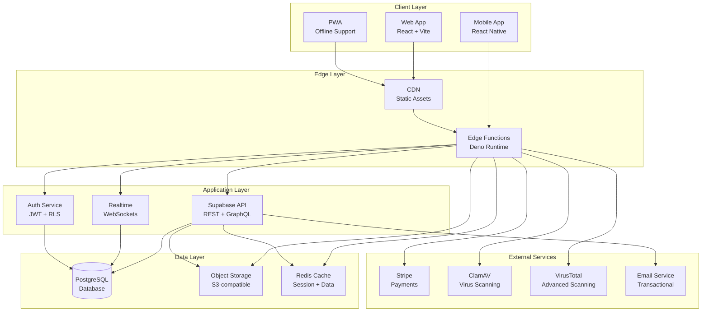
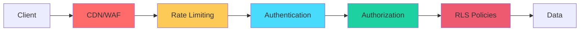

# 🏛️ High-Level Architecture

## Overzicht

Het Arabisch Leerplatform is een moderne, schaalbare webapplicatie gebouwd volgens een **serverless-first** architectuur met **edge computing** voor optimale performance wereldwijd.

## Architectuurdiagram



## 🏗️ Architectuurprincipes

### 1. **Serverless-First**
- Alle backend logic draait in Edge Functions
- Geen traditionele servers te onderhouden
- Auto-scaling op basis van vraag
- Pay-per-use kostenmodel

### 2. **Security by Design**
- Row-Level Security (RLS) op database niveau
- JWT-based authenticatie
- Rate limiting op alle endpoints
- Virus scanning voor alle uploads
- Content moderatie op forum posts

### 3. **Performance-Optimized**
- CDN voor statische assets
- Database indexes op kritieke queries
- Materialized views voor analytics
- Redis caching voor hot data
- Lazy loading en code splitting

### 4. **Multi-Tenant**
- Ondersteuning voor meerdere modules
- Geïsoleerde klassen per docent
- Verschillende niveaus per student
- Flexibele enrollment structuur

### 5. **Internationalization (i18n)**
- 3 talen: Nederlands, Engels, Arabisch
- RTL support voor Arabisch
- Locale-aware formatting (data, getallen, valuta)
- Dynamic content translation

### 6. **Accessibility-First**
- WCAG 2.1 AA compliance
- Keyboard navigation
- Screen reader support
- High contrast modes
- Focus management

## 📦 Technologie Stack

### Frontend
- **Framework**: React 18 + TypeScript
- **Build Tool**: Vite
- **Styling**: Tailwind CSS + Radix UI
- **State Management**: Zustand
- **Data Fetching**: TanStack Query
- **Forms**: React Hook Form + Zod
- **i18n**: i18next + ICU MessageFormat
- **Testing**: Vitest + Playwright + Axe

### Backend
- **Database**: PostgreSQL (Supabase)
- **Runtime**: Deno (Edge Functions)
- **Authentication**: Supabase Auth (JWT)
- **Storage**: Supabase Storage (S3)
- **Realtime**: Supabase Realtime (WebSockets)
- **Cache**: Redis (via Upstash)

### DevOps
- **CI/CD**: GitHub Actions
- **Hosting**: Vercel / Netlify
- **Monitoring**: Sentry
- **Analytics**: PostHog
- **Backups**: Automated daily (30-day retention)
- **IaC**: Terraform

### Security
- **Secret Scanning**: TruffleHog + Gitleaks
- **Virus Scanning**: ClamAV + VirusTotal
- **Content Moderation**: Custom engine + profanity filter
- **Rate Limiting**: Redis-based
- **Audit Logging**: Comprehensive (all actions)

## 🔄 Data Flow

### 1. User Request Flow
```
User → CDN → Edge Function → API Gateway → Database
                ↓
         Rate Limit Check
                ↓
         Authentication (JWT)
                ↓
         Authorization (RLS)
                ↓
         Business Logic
                ↓
         Response + Cache
```

### 2. File Upload Flow
```
User → Edge Function → Virus Scan → Storage
           ↓              ↓
    Size Check    Pattern Match
           ↓              ↓
    Metadata    ClamAV/VirusTotal
           ↓              ↓
      Quarantine if infected
           ↓
   Log to file_scans table
```

### 3. Realtime Communication
```
User A → WebSocket → Supabase Realtime → PostgreSQL
                                           ↓
                                    NOTIFY trigger
                                           ↓
User B ← WebSocket ← Supabase Realtime ← LISTEN
```

## 🌍 Deployment Architecture

### Productie Omgeving
- **Web App**: Vercel Edge Network (Globaal)
- **Edge Functions**: Supabase Edge Network (8 regio's)
- **Database**: Supabase (AWS eu-central-1)
- **Storage**: Supabase Storage (AWS S3)
- **CDN**: Vercel Edge (300+ PoPs)

### Staging Omgeving
- Identiek aan productie
- Aparte Supabase project
- Test data seeds
- E2E tests draaien hier

### Development Omgeving
- Lokaal Vite dev server
- Supabase CLI (lokale Postgres)
- Hot module replacement
- Mock data generators

## 📊 Capaciteitsplanning

### Huidige Schaal (Launch)
- **Users**: 0-1,000 actieve studenten
- **Requests**: ~10k/dag
- **Storage**: ~50 GB (media + backups)
- **Database**: Shared Supabase instance

### Toekomstige Schaal (Jaar 1)
- **Users**: 1,000-10,000 actieve studenten
- **Requests**: ~100k/dag
- **Storage**: ~500 GB
- **Database**: Dedicated Supabase instance + Read replicas

### Enterprise Schaal (Jaar 3+)
- **Users**: 10,000-100,000+ actieve studenten
- **Requests**: ~1M+/dag
- **Storage**: ~5 TB
- **Database**: PostgreSQL cluster + Sharding strategy

## 🔐 Security Layers



1. **WAF** (Web Application Firewall): DDoS protection, IP filtering
2. **Rate Limiting**: Redis-based, per-user/per-IP
3. **Authentication**: JWT tokens, refresh tokens, session management
4. **Authorization**: Role-based access control (RBAC)
5. **RLS**: Row-level security policies (PostgreSQL native)
6. **Encryption**: TLS 1.3 in transit, AES-256 at rest

## 📈 Monitoring & Observability

### Metrics
- **Performance**: Web Vitals (LCP, FID, CLS)
- **Errors**: Sentry error tracking
- **Usage**: PostHog analytics
- **Database**: Supabase dashboard + pganalyze

### Alerts
- **Critical**: Database downtime, edge function errors
- **Warning**: High response times, elevated error rates
- **Info**: Backup completion, deployment status

### Logs
- **Application**: Edge function logs (Deno)
- **Audit**: All security-relevant actions
- **Database**: Slow query log
- **Access**: CDN access logs

## 🚀 Schaalbaarheid Strategie

### Horizontal Scaling
- Edge functions: Auto-scale (Supabase)
- Database: Read replicas bij >70% CPU
- Storage: Unlimited (S3)
- Cache: Redis cluster bij >1M users

### Vertical Scaling
- Database: Upgrade Supabase plan
- Edge functions: Meer concurrent executions
- Storage: Lifecycle policies voor oude data

### Geographic Distribution
- CDN: Globaal (300+ PoPs)
- Edge functions: 8 regio's
- Database: Primary (EU), Replicas (US, APAC)

---

## 📚 Volgende Stappen

- [Data Flow Diagrams](./02-data-flow-diagrams.md)
- [Sequence Diagrams](./03-sequence-diagrams.md)
- [Service Interactions](./04-service-interactions.md)

---

**Laatst bijgewerkt:** 24 november 2025
