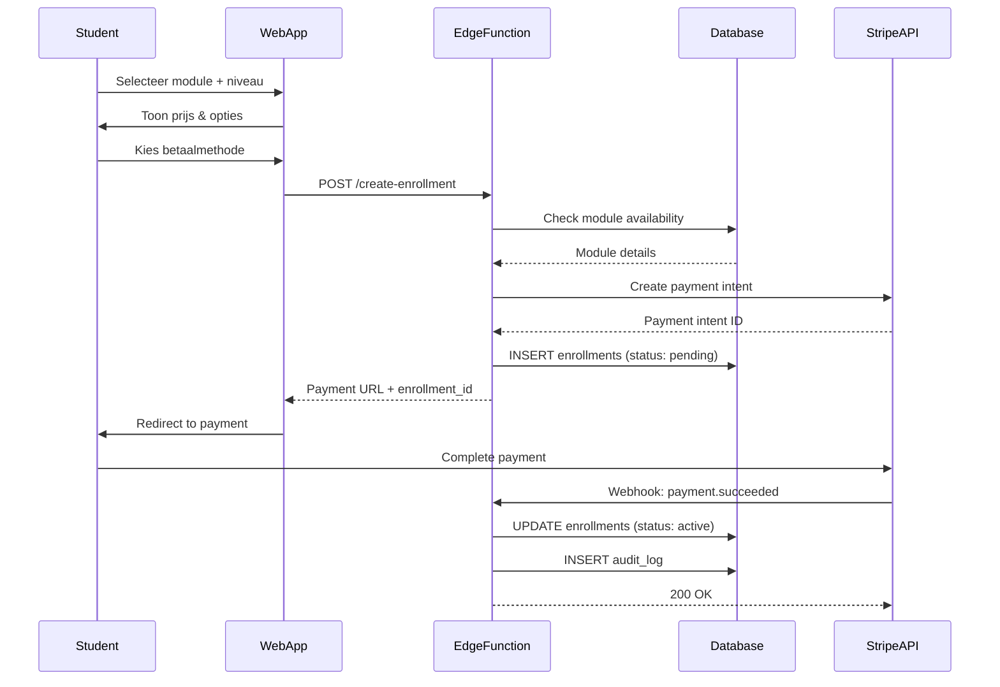
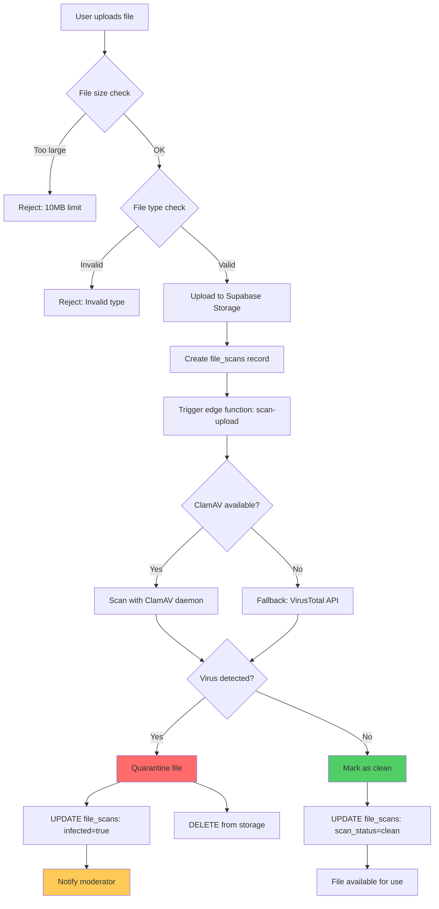
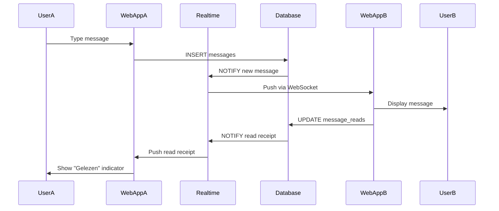
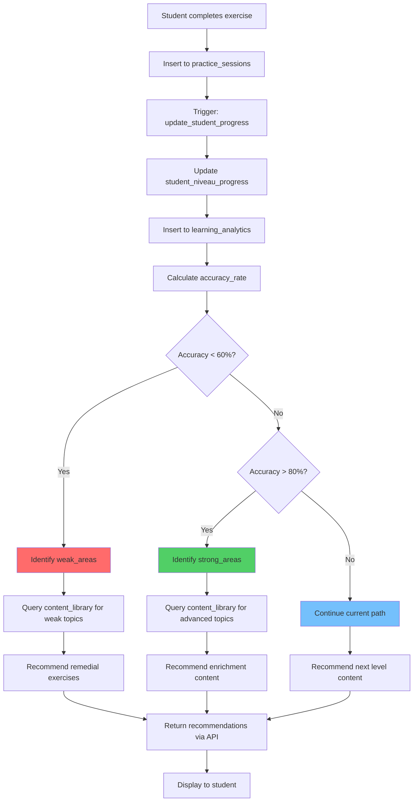
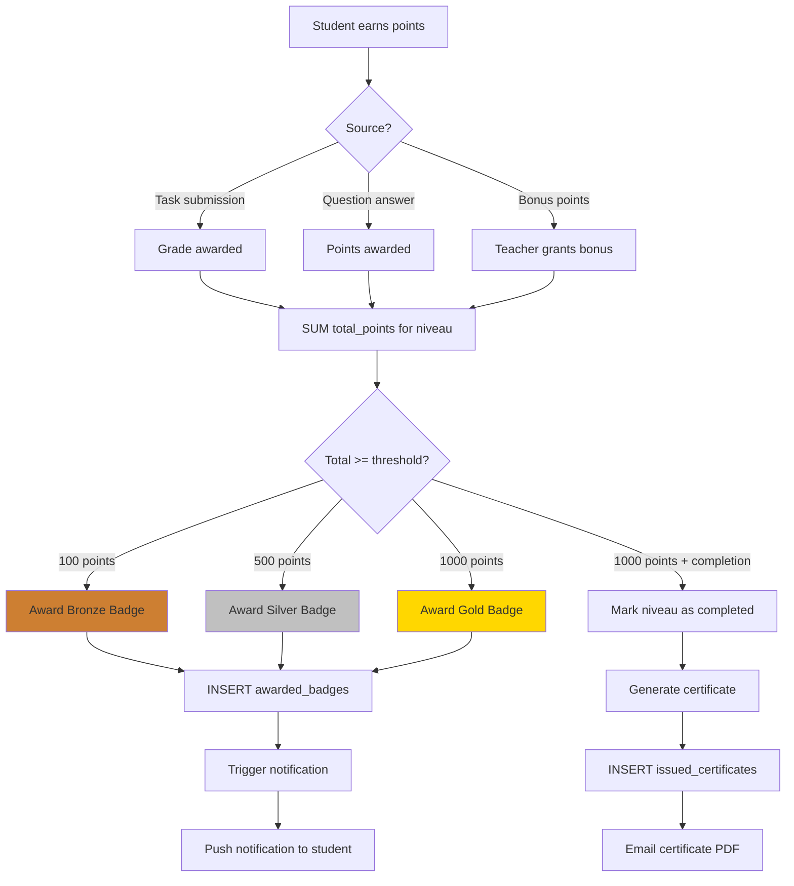
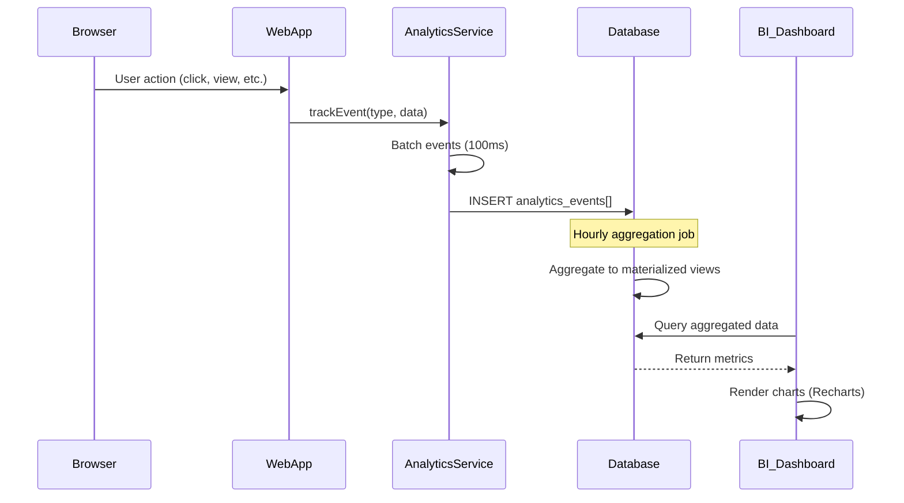
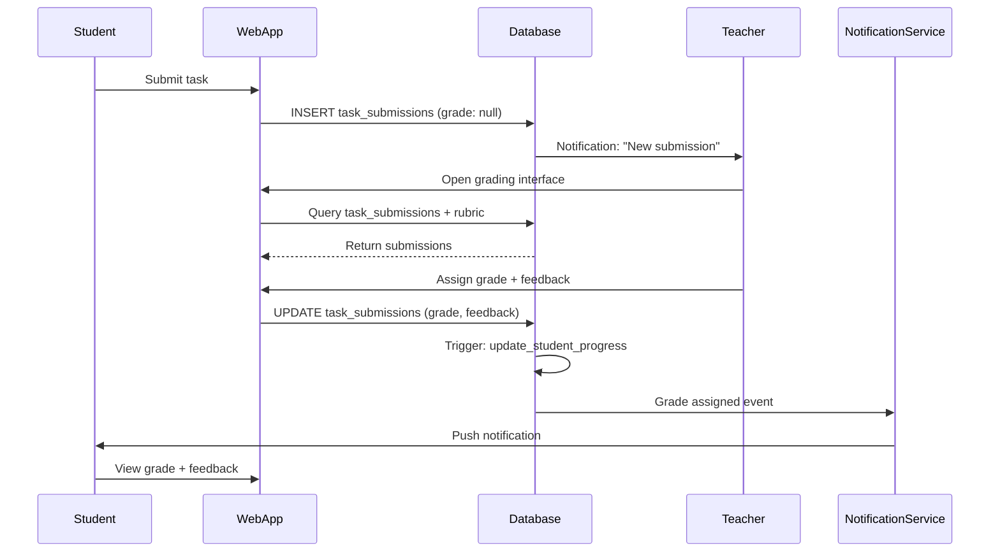
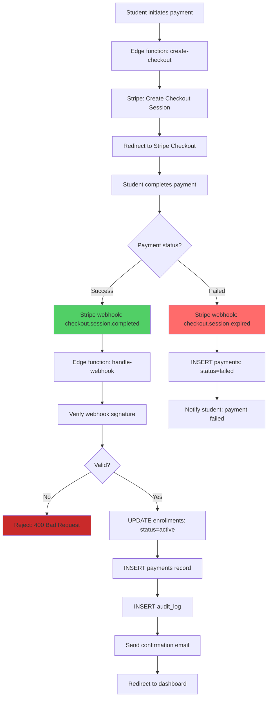

# 🔄 Data Flow Diagrams

## Overzicht

Deze sectie beschrijft de data flows binnen het Arabisch Leerplatform, van user input tot database persistence en terug.

---

## 1. Student Enrollment Flow



**Key Points:**
- Enrollment is created with `status: pending`
- Payment is handled by Stripe (external)
- Webhook updates enrollment to `active`
- All actions are logged in `audit_log`

---

## 2. Content Upload & Virus Scanning Flow



**Security Measures:**
1. **Size limit**: 10MB max
2. **Type whitelist**: Images, PDFs, Office docs
3. **Dual scanning**: ClamAV + VirusTotal
4. **Automatic quarantine**: Infected files are deleted
5. **Audit trail**: All scans logged to `file_scans` table

---

## 3. Real-time Chat Message Flow



**Performance Optimizations:**
- **WebSocket persistence**: Reduce reconnection overhead
- **Message batching**: Group multiple messages in 100ms window
- **Presence tracking**: Show "typing..." indicator
- **Read receipts**: Track per-message read status

---

## 4. Adaptive Learning Recommendation Flow



**Algorithm Logic:**
- **Weak areas** (<60% accuracy): Remedial exercises, video explanations
- **Strong areas** (>80% accuracy): Advanced challenges, bonus content
- **Average** (60-80%): Regular progression
- **Consistency check**: 3 consecutive weeks at level before advancement

---

## 5. Forum Post Moderation Flow

```mermaid
flowchart LR
    A[User creates post] --> B[INSERT forum_posts]
    B --> C[Trigger: profanity_check]
    C --> D{Contains profanity?}
    D -->|Yes| E[Auto-flag post]
    D -->|No| F[Publish post]
    E --> G[INSERT content_moderation]
    G --> H[Notify moderators]
    H --> I[Moderator reviews]
    I --> J{Decision}
    J -->|Approve| K[UPDATE: is_gerapporteerd=false]
    J -->|Delete| L[UPDATE: is_verwijderd=true]
    J -->|Warn user| M[INSERT user_warnings]
    K --> F
    L --> N[Hidden from feed]
    M --> O{Warning count >= 3?}
    O -->|Yes| P[INSERT ban_history]
    O -->|No| Q[User notified]
    P --> R[User banned (temp/permanent)]
    
    style E fill:#feca57
    style L fill:#ff6b6b
    style P fill:#c92a2a
```

**Moderation Triggers:**
1. **Profanity filter**: Keyword-based (Dutch, English, Arabic)
2. **Spam detection**: Duplicate content, excessive links
3. **User reports**: Manual flagging by community
4. **Automated patterns**: Multiple posts in short time

---

## 6. Progress Tracking & Badges Flow



**Badge Thresholds:**
- **Bronze**: 100, 200, 300, 400 points
- **Silver**: 500, 600, 700, 800, 900 points
- **Gold**: 1000 points (niveau completion)
- **Special badges**: Consistency (3-week streak), Excellence (>90% avg)

---

## 7. Analytics Event Tracking Flow



**Tracked Events:**
- **Page views**: URL, timestamp, session_id
- **User actions**: Clicks, form submissions, video plays
- **Performance**: Web Vitals (LCP, FID, CLS)
- **Errors**: Client-side errors, API failures
- **Engagement**: Time on page, scroll depth

**Aggregations:**
- **Hourly**: Basic metrics (views, users)
- **Daily**: Retention, engagement scores
- **Weekly**: Cohort analysis, churn prediction
- **Monthly**: Revenue, LTV, CAC

---

## 8. Backup & Restore Flow

```mermaid
flowchart TD
    A[GitHub Action: Daily 03:00 UTC] --> B[Trigger backup-database.yml]
    B --> C[pg_dump via Supabase API]
    C --> D[Compress with gzip]
    D --> E[Encrypt with GPG]
    E --> F[Upload to GitHub Artifacts]
    F --> G[Tag with timestamp]
    G --> H{Retention check}
    H -->|> 30 days| I[Delete old backups]
    H -->|<= 30 days| J[Keep backup]
    
    K[Restore needed] --> L[Download artifact]
    L --> M[Decrypt with GPG key]
    M --> N[Decompress gzip]
    N --> O[pg_restore to staging DB]
    O --> P[Run validation tests]
    P --> Q{Tests pass?}
    Q -->|Yes| R[Confirm restore]
    Q -->|No| S[Rollback & investigate]
    R --> T[Production restore (if needed)]
    
    style I fill:#feca57
    style S fill:#ff6b6b
    style R fill:#51cf66
```

**Backup Strategy:**
- **Frequency**: Daily at 03:00 UTC
- **Retention**: 30 days rolling window
- **Storage**: GitHub Artifacts (encrypted)
- **Size**: ~500MB compressed (estimated)
- **Testing**: Quarterly restore drills

---

## 9. Teacher Grading Workflow



**Grading Features:**
- **Rubrics**: Pre-defined criteria with point values
- **Bulk grading**: Grade multiple submissions at once
- **Feedback templates**: Reusable comments
- **Grade distribution**: Analytics per class/level

---

## 10. Payment Processing Flow (Stripe)



**Payment Types:**
- **One-time**: Full module price upfront
- **Installments**: Monthly payments (3-12 months)
- **Per-class**: Pay per enrolled class
- **Subscription**: Monthly access to all modules

---

## Data Flow Summary

| Flow | Latency | Throughput | Critical? |
|------|---------|------------|-----------|
| Enrollment | ~2-5s | Low (10/day) | High |
| File Upload | ~5-30s | Medium (100/day) | High |
| Chat Messages | <100ms | High (1k/hour) | Medium |
| Adaptive Recs | ~500ms | Medium (500/day) | Medium |
| Forum Moderation | ~2s | Low (50/day) | High |
| Progress Tracking | <200ms | High (5k/day) | Low |
| Analytics | Batch | Very High (100k/day) | Low |
| Backups | ~10min | Daily | High |
| Grading | ~1s | Low (50/day) | Medium |
| Payments | ~3-10s | Low (20/day) | Critical |

---

## Next Steps

- [Sequence Diagrams](./03-sequence-diagrams.md)
- [Service Interactions](./04-service-interactions.md)
- [Edge Functions](./05-edge-functions.md)

---

**Laatst bijgewerkt:** 25 november 2025
