# 📊 Sequence Diagrams

Gedetailleerde sequence diagrams voor kritieke workflows.

---

## 1. User Authentication Flow


**Security Measures:**
- JWT tokens expire after 1 hour
- Refresh tokens valid for 30 days
- Rate limiting: 5 failed attempts = 15min lockout
- MFA optional (TOTP)

---

## 2. Exercise Completion & Adaptive Recommendation


**Recommendation Algorithm:**
1. Analyze last 20 practice sessions
2. Calculate accuracy per topic
3. Identify weak areas (<60% accuracy)
4. Identify strong areas (>80% accuracy)
5. Query content library for matching difficulty
6. Return top 5 recommendations per category

---

## 3. Forum Post with Auto-Moderation


**Moderation Rules:**
- Dutch profanity list: 500+ words
- English profanity list: 300+ words
- Arabic profanity list: 200+ words
- Pattern matching: URLs, emails, phone numbers
- Spam detection: Duplicate content within 1 hour

---

## 4. Teacher Grading with Rubric


**Rubric Structure:**
```json
{
  "rubric_id": "uuid",
  "task_id": "uuid",
  "criteria": [
    {
      "name": "Grammar",
      "max_points": 25,
      "description": "Correct use of grammar rules"
    },
    {
      "name": "Vocabulary",
      "max_points": 25,
      "description": "Appropriate vocabulary usage"
    },
    {
      "name": "Spelling",
      "max_points": 25,
      "description": "Accurate spelling"
    },
    {
      "name": "Structure",
      "max_points": 25,
      "description": "Clear structure and coherence"
    }
  ],
  "total_points": 100
}
```

---

## 5. Real-time Chat with Typing Indicator

```mermaid
sequenceDiagram
    participant StudentA
    participant WebAppA
    participant Realtime
    participant Database
    participant WebAppB
    participant StudentB
    
    StudentA->>WebAppA: Start typing
    WebAppA->>Realtime: presence.track({typing: true})
    Realtime->>WebAppB: presence.change event
    WebAppB->>StudentB: Show "Student A is typing..."
    
    StudentA->>WebAppA: Send message
    WebAppA->>Database: INSERT messages
    Database->>Realtime: NOTIFY new_message
    Realtime->>WebAppB: Push message via WebSocket
    WebAppB->>StudentB: Display message
    
    WebAppA->>Realtime: presence.track({typing: false})
    Realtime->>WebAppB: presence.change event
    WebAppB->>StudentB: Hide typing indicator
    
    StudentB->>WebAppB: Read message
    WebAppB->>Database: INSERT message_reads
    Database->>Realtime: NOTIFY message_read
    Realtime->>WebAppA: Push read receipt
    WebAppA->>StudentA: Update to "Gelezen ✓✓"
```



**Performance Optimizations:**
- Typing indicator debounced (300ms)
- Message batching (max 10 msgs/100ms)
- Presence heartbeat every 30s
- Auto-reconnect on disconnect

---

## 6. Payment with Webhook Verification


**Webhook Security:**
1. Verify Stripe signature (HMAC-SHA256)
2. Check timestamp (reject if > 5min old)
3. Idempotency: Use event ID to prevent duplicates
4. Atomic updates: Use database transactions

---

## 7. Backup & Restore Process


**Backup Metrics:**
- Average size: ~500MB compressed
- Encryption: GPG with 4096-bit RSA key
- Transfer time: ~2 minutes
- Retention: 30 days = 15GB total storage

---

## 8. Certificate Issuance

```mermaid
sequenceDiagram
    participant Student
    participant UI
    participant EdgeFunc
    participant Database
    participant PDFGenerator
    participant EmailService
    
    Note over Student: Completes all requirements
    Database->>Database: Trigger: niveau completion check
    Database->>Database: Check criteria met
    
    alt All criteria met
        Database->>EdgeFunc: Event: niveau_completed
        EdgeFunc->>Database: Query student + niveau details
        Database-->>EdgeFunc: Student profile + achievements
        
        EdgeFunc->>Database: SELECT certificate_template
        Database-->>EdgeFunc: Template design (JSON)
        
        EdgeFunc->>PDFGenerator: Generate certificate PDF
        PDFGenerator->>PDFGenerator: Populate template with data
        PDFGenerator->>PDFGenerator: Generate QR code (verification URL)
        PDFGenerator-->>EdgeFunc: PDF bytes
        
        EdgeFunc->>Database: INSERT issued_certificates
        EdgeFunc->>Database: Upload PDF to storage
        Database-->>EdgeFunc: Certificate ID
        
        EdgeFunc->>EmailService: Send certificate email
        EmailService->>Student: Email with PDF attachment
        
        EdgeFunc->>Database: INSERT notifications
        Database->>UI: Push notification
        UI->>Student: "Certificaat behaald! 🎓"
    else Criteria not met
        Database->>Database: Log: Incomplete requirements
    end
```



**Certificate Data:**
```json
{
  "certificate_id": "CERT-2025-001234",
  "student_name": "Ahmed Hassan",
  "niveau_name": "Niveau 3: Gemiddeld",
  "completion_date": "2025-11-25",
  "total_points": 1050,
  "average_score": 87.5,
  "teacher_signature": "Dr. Fatima Al-Zahra",
  "qr_code": "https://platform.com/verify/CERT-2025-001234",
  "signature_hash": "SHA256:abc123..."
}
```

---

## Performance Benchmarks

| Sequence | Avg Time | P95 | P99 | SLA |
|----------|----------|-----|-----|-----|
| Authentication | 250ms | 400ms | 600ms | <1s |
| Adaptive Recs | 500ms | 800ms | 1.2s | <2s |
| Forum Post | 300ms | 500ms | 800ms | <1s |
| Grading | 200ms | 350ms | 500ms | <1s |
| Chat Message | 80ms | 150ms | 250ms | <500ms |
| Payment Webhook | 400ms | 700ms | 1s | <2s |
| Backup | 10min | 12min | 15min | <20min |
| Certificate | 2s | 3s | 5s | <10s |

---

## Next Steps

- [Service Interactions](./04-service-interactions.md)
- [Edge Functions](./05-edge-functions.md)
- [Database Schema](./06-database-schema.md)

---

**Laatst bijgewerkt:** 25 november 2025
