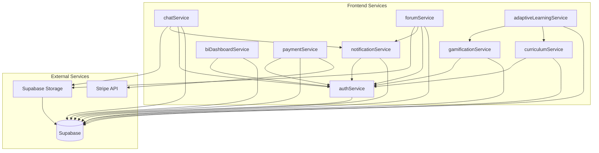
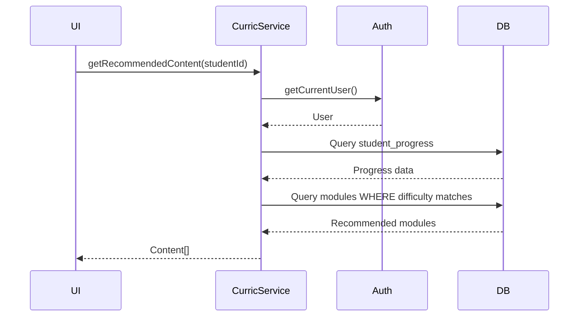
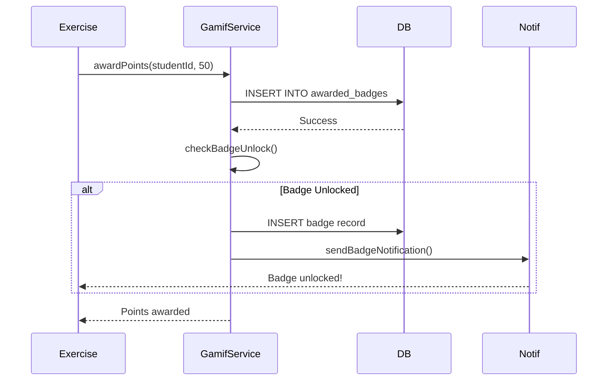
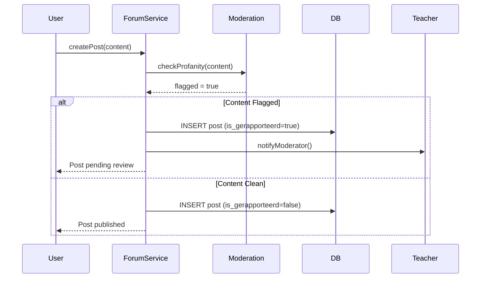
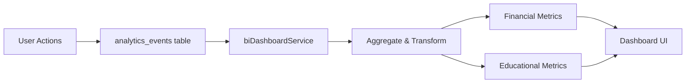
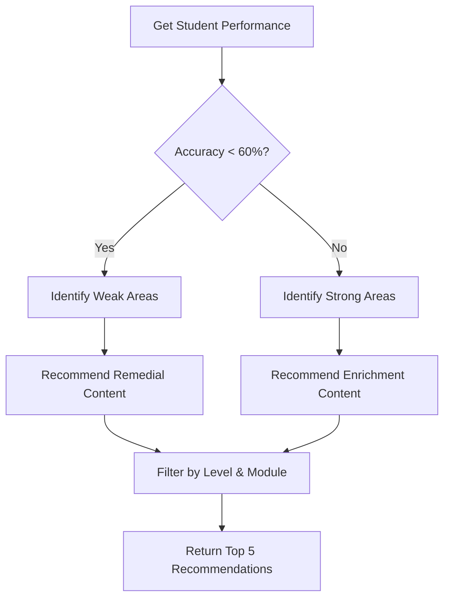
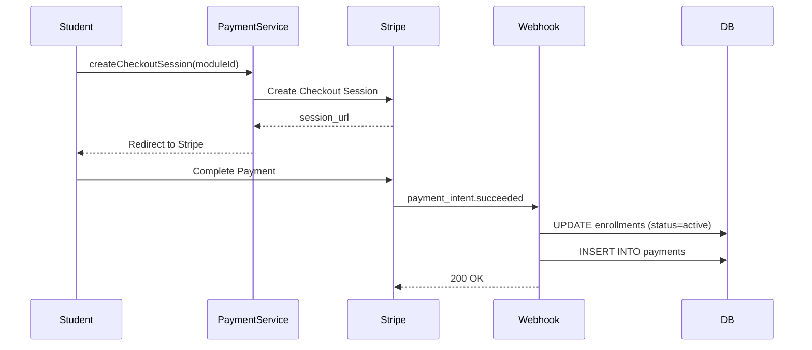

# Service Interactions & Dependencies

**Document:** 04 - Service Interactions  
**Laatst Bijgewerkt:** 2025-01-25  
**Status:** ✅ Volledig

## Overzicht

Dit document beschrijft de interacties tussen verschillende services in het Arabic Learning Platform en hun onderlinge afhankelijkheden.

## Service Dependency Map



## Service Interactie Patronen

### 1. Authentication Service (authService)

**Verantwoordelijkheden:**
- User login/logout
- Session management
- JWT token handling
- Role-based access control

**Dependencies:**
- Supabase Auth

**Consumed By:**
- Alle andere services (voor authenticatie)

**Key Methods:**
```typescript
- getCurrentUser(): Promise<User>
- login(email, password): Promise<Session>
- logout(): Promise<void>
- hasRole(role): boolean
```

---

### 2. Curriculum Service (curriculumService)

**Verantwoordelijkheden:**
- Manage learning modules, levels, and lessons
- Track student progress
- Generate learning paths
- Content recommendations

**Dependencies:**
- Supabase (modules, niveaus, lessen tables)
- authService (user context)

**Consumed By:**
- adaptiveLearningService
- biDashboardService
- Frontend components (LessonView, ModuleCard, etc.)

**Key Interactions:**
```typescript
// Used by Adaptive Learning
curriculumService.getModulesByLevel(levelId)
curriculumService.getStudentProgress(studentId)

// Used by BI Dashboard
curriculumService.getModuleCompletionRate(moduleId)
```

**Sequence Example:**


---

### 3. Gamification Service (gamificationService)

**Verantwoordelijkheden:**
- Award XP points
- Manage badges and achievements
- Maintain leaderboards
- Track streaks and milestones

**Dependencies:**
- Supabase (awarded_badges, leaderboard_entries)
- authService (student context)

**Consumed By:**
- curriculumService (on lesson completion)
- adaptiveLearningService (on exercise completion)
- Frontend components (LeaderboardCard, BadgeDisplay)

**Key Interactions:**
```typescript
// Award points after exercise
gamificationService.awardPoints({
  studentId: user.id,
  points: 50,
  reason: 'exercise_completion',
  categoryId: 'grammar'
})

// Check for badge unlock
gamificationService.checkBadgeUnlock(studentId, 'streak_7_days')
```

**Event Flow:**


---

### 4. Chat Service (chatService)

**Verantwoordelijkheden:**
- Real-time messaging
- Conversation management
- Read receipts
- File attachments

**Dependencies:**
- Supabase (conversations, conversation_participants, direct_messages)
- Supabase Storage (for attachments)
- authService (user identity)
- notificationService (message notifications)

**Consumed By:**
- ChatInterface component
- NotificationCenter

**Realtime Subscription Pattern:**
```typescript
// Subscribe to new messages
chatService.subscribeToConversation(conversationId, (message) => {
  // Update UI
  displayMessage(message)
  
  // Send read receipt
  chatService.markAsRead(message.id)
  
  // Trigger notification if user not in focus
  if (!isWindowFocused) {
    notificationService.showMessageNotification(message)
  }
})
```

---

### 5. Forum Service (forumService)

**Verantwoordelijkheden:**
- Thread creation and management
- Post moderation
- Likes/dislikes tracking
- Search and filtering

**Dependencies:**
- Supabase (forum_threads, forum_posts, forum_likes)
- authService (author verification)
- notificationService (reply notifications)

**Consumed By:**
- ForumMain component
- ModerationDashboard

**Content Moderation Flow:**


---

### 6. Notification Service (notificationService)

**Verantwoordelijkheden:**
- Push notifications
- Email notifications
- In-app notification center
- Notification preferences

**Dependencies:**
- Supabase (push_subscriptions table - if implemented)
- authService (user preferences)

**Consumed By:**
- chatService (message notifications)
- forumService (reply notifications)
- gamificationService (badge notifications)
- curriculumService (deadline reminders)

**Notification Types:**
```typescript
type NotificationType = 
  | 'message'           // New chat message
  | 'forum_reply'       // Reply to forum post
  | 'badge_earned'      // Badge unlocked
  | 'deadline_reminder' // Upcoming deadline
  | 'grade_received'    // Teacher graded submission
  | 'streak_milestone'  // Learning streak achieved
```

---

### 7. BI Dashboard Service (biDashboardService)

**Verantwoordelijkheden:**
- Financial analytics
- Educational analytics
- Funnel tracking
- Revenue reporting

**Dependencies:**
- Supabase (payments, enrollments, student_progress)
- authService (admin/teacher verification)

**Consumed By:**
- FinancialDashboard component
- EducationalDashboard component
- AdminAnalytics page

**Analytics Pipeline:**


---

### 8. Adaptive Learning Service (adaptiveLearningService)

**Verantwoordelijkheden:**
- Performance analysis
- Weak/strong area identification
- Content recommendation
- Difficulty adjustment

**Dependencies:**
- Supabase (learning_analytics, antwoorden, student_progress)
- curriculumService (content retrieval)
- gamificationService (reward calculation)

**Consumed By:**
- StudentDashboard
- LessonRecommendations component

**Recommendation Algorithm:**


---

### 9. Payment Service (paymentService)

**Verantwoordelijkheden:**
- Stripe checkout sessions
- Subscription management
- Invoice handling
- Payment webhooks

**Dependencies:**
- Stripe API
- Supabase (payments, enrollments)
- authService (customer identification)

**Consumed By:**
- EnrollmentFlow component
- BillingPage

**Payment Flow:**


---

## Cross-Service Communication Patterns

### Event-Driven Pattern
```typescript
// Example: Exercise Completion Event
exerciseCompleted({
  studentId: 'uuid',
  exerciseId: 'uuid',
  score: 85,
  timeSpent: 300
})

// Triggers:
1. gamificationService.awardPoints()
2. curriculumService.updateProgress()
3. adaptiveLearningService.analyzePerformance()
4. notificationService.sendStreakUpdate()
```

### Service Orchestration Pattern
```typescript
// Example: Student Enrollment Flow
async function enrollStudent(studentId: string, moduleId: string) {
  // 1. Create payment session
  const session = await paymentService.createCheckout(moduleId)
  
  // 2. On payment success (webhook):
  await enrollmentService.activateEnrollment(studentId, moduleId)
  
  // 3. Assign initial curriculum
  await curriculumService.assignInitialLessons(studentId, moduleId)
  
  // 4. Send welcome notification
  await notificationService.sendWelcomeEmail(studentId)
  
  // 5. Award enrollment badge
  await gamificationService.awardBadge(studentId, 'first_enrollment')
}
```

---

## Performance Considerations

### Caching Strategy
```typescript
// curriculumService uses React Query caching
useQuery(['module', moduleId], () => 
  curriculumService.getModuleById(moduleId),
  { staleTime: 5 * 60 * 1000 } // 5 minutes
)

// biDashboardService caches aggregated metrics
const CACHE_TTL = 15 * 60 * 1000 // 15 minutes
```

### Batch Operations
```typescript
// gamificationService batches XP awards
gamificationService.batchAwardPoints([
  { studentId: 'uuid1', points: 50 },
  { studentId: 'uuid2', points: 75 },
  { studentId: 'uuid3', points: 30 }
])
```

---

## Error Handling & Resilience

### Service Failure Strategies

1. **Graceful Degradation**: If gamificationService fails, exercise completion still succeeds
2. **Retry Logic**: Chat messages retry 3 times with exponential backoff
3. **Circuit Breaker**: Adaptive learning recommendations fall back to default curriculum
4. **Error Boundaries**: React components catch service errors and show fallback UI

```typescript
try {
  await gamificationService.awardPoints(studentId, 50)
} catch (error) {
  // Log error but don't block exercise completion
  console.error('Gamification service failed:', error)
  // Continue with exercise flow
}
```

---

## Security Boundaries

### Authorization Checks
```typescript
// Every service method checks permissions
async function getStudentData(studentId: string) {
  const currentUser = await authService.getCurrentUser()
  
  if (!authService.canAccessStudent(currentUser, studentId)) {
    throw new ForbiddenError('Access denied')
  }
  
  // Proceed with data retrieval
}
```

### Data Isolation
- Row Level Security (RLS) enforced at database level
- Services never bypass RLS policies
- Teacher/admin roles verified before privileged operations

---

## Testing Strategy

### Unit Tests
```typescript
describe('curriculumService', () => {
  it('should recommend content based on weak areas', async () => {
    const recommendations = await curriculumService.getRecommendedContent('student-id')
    expect(recommendations).toHaveLength(5)
  })
})
```

### Integration Tests
```typescript
describe('Exercise Completion Flow', () => {
  it('should update progress, award points, and send notification', async () => {
    await completeExercise({ studentId, exerciseId, score: 85 })
    
    expect(curriculumService.getProgress).toHaveBeenCalled()
    expect(gamificationService.awardPoints).toHaveBeenCalledWith(50)
    expect(notificationService.send).toHaveBeenCalled()
  })
})
```

---

## Future Enhancements

1. **Service Mesh**: Implement Istio for advanced traffic management
2. **GraphQL Federation**: Unify service APIs under single GraphQL endpoint
3. **Event Sourcing**: Full audit trail of all state changes
4. **CQRS Pattern**: Separate read/write models for better scalability

---

## References

- [High-Level Architecture](./01-high-level-architecture.md)
- [Data Flow Diagrams](./02-data-flow-diagrams.md)
- [Sequence Diagrams](./03-sequence-diagrams.md)
