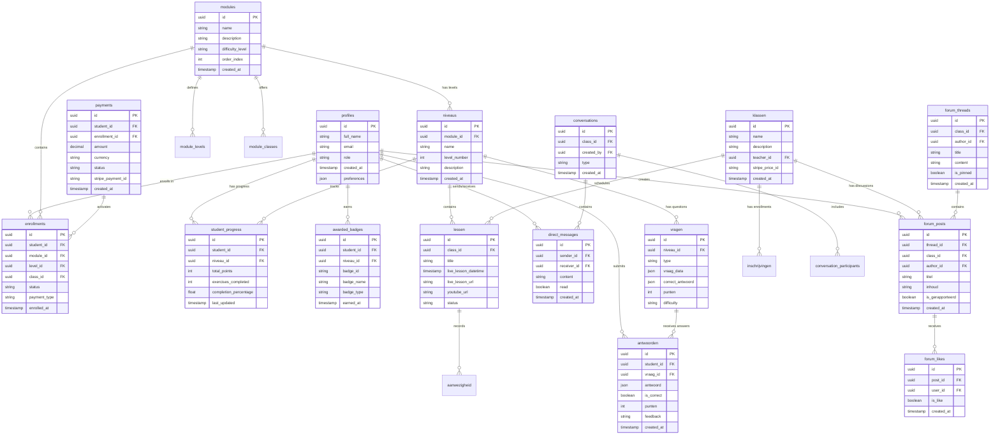

# Database Schema & Entity Relationships

**Document:** 06 - Database Schema  
**Laatst Bijgewerkt:** 2025-01-25  
**Status:** ✅ Volledig

## Overzicht

Dit document beschrijft de database schema architectuur, entity relationships, en data modeling beslissingen voor het Arabic Learning Platform.

## Entity Relationship Diagram



## Core Tables

### 1. User Management

#### `profiles`
```sql
CREATE TABLE profiles (
  id UUID PRIMARY KEY REFERENCES auth.users,
  full_name TEXT NOT NULL,
  email TEXT UNIQUE NOT NULL,
  role TEXT CHECK (role IN ('student', 'teacher', 'admin')),
  avatar_url TEXT,
  preferences JSONB DEFAULT '{}',
  created_at TIMESTAMPTZ DEFAULT NOW(),
  updated_at TIMESTAMPTZ DEFAULT NOW()
);

-- RLS Policies
ALTER TABLE profiles ENABLE ROW LEVEL SECURITY;

CREATE POLICY "Users can view their own profile"
  ON profiles FOR SELECT
  USING (auth.uid() = id);

CREATE POLICY "Users can update their own profile"
  ON profiles FOR UPDATE
  USING (auth.uid() = id);
```

---

### 2. Curriculum Structure

#### `modules`
```sql
CREATE TABLE modules (
  id UUID PRIMARY KEY DEFAULT gen_random_uuid(),
  name TEXT NOT NULL,
  description TEXT,
  difficulty_level TEXT CHECK (difficulty_level IN ('beginner', 'intermediate', 'advanced')),
  order_index INT NOT NULL,
  is_published BOOLEAN DEFAULT FALSE,
  created_at TIMESTAMPTZ DEFAULT NOW(),
  updated_at TIMESTAMPTZ DEFAULT NOW()
);

CREATE INDEX idx_modules_difficulty ON modules(difficulty_level);
CREATE INDEX idx_modules_published ON modules(is_published);
```

#### `niveaus` (Levels)
```sql
CREATE TABLE niveaus (
  id UUID PRIMARY KEY DEFAULT gen_random_uuid(),
  module_id UUID REFERENCES modules(id) ON DELETE CASCADE,
  name TEXT NOT NULL,
  level_number INT NOT NULL,
  description TEXT,
  prerequisites JSONB DEFAULT '[]',
  created_at TIMESTAMPTZ DEFAULT NOW(),
  UNIQUE(module_id, level_number)
);

CREATE INDEX idx_niveaus_module ON niveaus(module_id);
```

#### `lessen` (Lessons)
```sql
CREATE TABLE lessen (
  id UUID PRIMARY KEY DEFAULT gen_random_uuid(),
  class_id UUID REFERENCES klassen(id) ON DELETE CASCADE,
  title TEXT NOT NULL,
  live_lesson_datetime TIMESTAMPTZ,
  live_lesson_url TEXT,
  youtube_url TEXT,
  status TEXT DEFAULT 'scheduled',
  preparation_deadline TIMESTAMPTZ,
  created_at TIMESTAMPTZ DEFAULT NOW(),
  updated_at TIMESTAMPTZ DEFAULT NOW(),
  tsv TSVECTOR
);

-- Full-text search
CREATE INDEX idx_lessen_search ON lessen USING GIN(tsv);
```

---

### 3. Student Progress Tracking

#### `student_progress`
```sql
CREATE TABLE student_progress (
  id UUID PRIMARY KEY DEFAULT gen_random_uuid(),
  student_id UUID REFERENCES profiles(id) ON DELETE CASCADE,
  niveau_id UUID REFERENCES niveaus(id) ON DELETE CASCADE,
  module_id UUID REFERENCES modules(id) ON DELETE CASCADE,
  total_points INT DEFAULT 0,
  exercises_completed INT DEFAULT 0,
  completion_percentage DECIMAL(5,2) DEFAULT 0.00,
  last_updated TIMESTAMPTZ DEFAULT NOW(),
  UNIQUE(student_id, niveau_id)
);

CREATE INDEX idx_progress_student ON student_progress(student_id);
CREATE INDEX idx_progress_niveau ON student_progress(niveau_id);
CREATE INDEX idx_progress_updated ON student_progress(last_updated);

-- RLS: Students see only their own progress
ALTER TABLE student_progress ENABLE ROW LEVEL SECURITY;

CREATE POLICY "Students view own progress"
  ON student_progress FOR SELECT
  USING (auth.uid() = student_id);

CREATE POLICY "Teachers view class progress"
  ON student_progress FOR SELECT
  USING (
    EXISTS (
      SELECT 1 FROM klassen k
      JOIN inschrijvingen i ON k.id = i.class_id
      WHERE k.teacher_id = auth.uid()
        AND i.student_id = student_progress.student_id
    )
  );
```

#### `enrollments`
```sql
CREATE TABLE enrollments (
  id UUID PRIMARY KEY DEFAULT gen_random_uuid(),
  student_id UUID REFERENCES profiles(id) ON DELETE CASCADE,
  module_id UUID REFERENCES modules(id) ON DELETE CASCADE,
  level_id UUID REFERENCES module_levels(id),
  class_id UUID REFERENCES module_classes(id),
  status TEXT DEFAULT 'pending' CHECK (status IN ('pending', 'active', 'completed', 'cancelled')),
  payment_type TEXT CHECK (payment_type IN ('free', 'paid', 'subscription')),
  enrolled_at TIMESTAMPTZ DEFAULT NOW(),
  activated_at TIMESTAMPTZ,
  last_activity TIMESTAMPTZ,
  UNIQUE(student_id, module_id)
);

CREATE INDEX idx_enrollments_student ON enrollments(student_id);
CREATE INDEX idx_enrollments_status ON enrollments(status);
CREATE INDEX idx_enrollments_module ON enrollments(module_id);
```

---

### 4. Gamification

#### `awarded_badges`
```sql
CREATE TABLE awarded_badges (
  id UUID PRIMARY KEY DEFAULT gen_random_uuid(),
  student_id UUID REFERENCES profiles(id) ON DELETE CASCADE,
  niveau_id UUID REFERENCES niveaus(id) ON DELETE CASCADE,
  badge_id TEXT NOT NULL,
  badge_name TEXT NOT NULL,
  badge_type TEXT NOT NULL,
  badge_description TEXT,
  points_threshold INT,
  reason TEXT,
  awarded_by UUID REFERENCES profiles(id),
  earned_at TIMESTAMPTZ DEFAULT NOW(),
  UNIQUE(student_id, badge_id, niveau_id)
);

CREATE INDEX idx_badges_student ON awarded_badges(student_id);
CREATE INDEX idx_badges_earned ON awarded_badges(earned_at);
```

#### `leaderboard_entries`
```sql
CREATE TABLE leaderboard_entries (
  id UUID PRIMARY KEY DEFAULT gen_random_uuid(),
  student_id UUID REFERENCES profiles(id) ON DELETE CASCADE,
  leaderboard_type TEXT NOT NULL,
  score INT NOT NULL,
  rank INT,
  time_period TEXT,
  scope_id UUID,
  calculated_at TIMESTAMPTZ DEFAULT NOW()
);

CREATE INDEX idx_leaderboard_type ON leaderboard_entries(leaderboard_type);
CREATE INDEX idx_leaderboard_rank ON leaderboard_entries(rank);
CREATE INDEX idx_leaderboard_period ON leaderboard_entries(time_period);
```

---

### 5. Assessment & Questions

#### `vragen` (Questions)
```sql
CREATE TABLE vragen (
  id UUID PRIMARY KEY DEFAULT gen_random_uuid(),
  niveau_id UUID REFERENCES niveaus(id) ON DELETE CASCADE,
  type TEXT NOT NULL CHECK (type IN ('multiple_choice', 'fill_blank', 'essay', 'audio', 'matching')),
  vraag_data JSONB NOT NULL,
  correct_antwoord JSONB,
  punten INT DEFAULT 1,
  difficulty TEXT CHECK (difficulty IN ('easy', 'medium', 'hard')),
  tags TEXT[],
  created_at TIMESTAMPTZ DEFAULT NOW()
);

CREATE INDEX idx_vragen_niveau ON vragen(niveau_id);
CREATE INDEX idx_vragen_type ON vragen(type);
CREATE INDEX idx_vragen_difficulty ON vragen(difficulty);
```

#### `antwoorden` (Answers/Submissions)
```sql
CREATE TABLE antwoorden (
  id UUID PRIMARY KEY DEFAULT gen_random_uuid(),
  student_id UUID REFERENCES profiles(id) ON DELETE CASCADE,
  vraag_id UUID REFERENCES vragen(id) ON DELETE CASCADE,
  antwoord JSONB NOT NULL,
  is_correct BOOLEAN,
  punten INT,
  feedback TEXT,
  beoordeeld_door UUID REFERENCES profiles(id),
  created_at TIMESTAMPTZ DEFAULT NOW(),
  updated_at TIMESTAMPTZ DEFAULT NOW()
);

CREATE INDEX idx_antwoorden_student ON antwoorden(student_id);
CREATE INDEX idx_antwoorden_vraag ON antwoorden(vraag_id);
CREATE INDEX idx_antwoorden_created ON antwoorden(created_at);

-- RLS
ALTER TABLE antwoorden ENABLE ROW LEVEL SECURITY;

CREATE POLICY "Students view own answers"
  ON antwoorden FOR SELECT
  USING (auth.uid() = student_id);

CREATE POLICY "Students submit answers"
  ON antwoorden FOR INSERT
  WITH CHECK (auth.uid() = student_id);

CREATE POLICY "Teachers grade answers"
  ON antwoorden FOR UPDATE
  USING (
    EXISTS (
      SELECT 1 FROM profiles
      WHERE id = auth.uid() AND role IN ('teacher', 'admin')
    )
  );
```

---

### 6. Forum & Community

#### `forum_threads`
```sql
CREATE TABLE forum_threads (
  id UUID PRIMARY KEY DEFAULT gen_random_uuid(),
  class_id UUID REFERENCES klassen(id) ON DELETE CASCADE,
  author_id UUID REFERENCES profiles(id) ON DELETE CASCADE,
  title TEXT NOT NULL,
  content TEXT NOT NULL,
  body TEXT DEFAULT '',
  is_pinned BOOLEAN DEFAULT FALSE,
  comments_enabled BOOLEAN DEFAULT TRUE,
  status TEXT DEFAULT 'active',
  created_at TIMESTAMPTZ DEFAULT NOW(),
  tsv TSVECTOR
);

CREATE INDEX idx_threads_class ON forum_threads(class_id);
CREATE INDEX idx_threads_author ON forum_threads(author_id);
CREATE INDEX idx_threads_search ON forum_threads USING GIN(tsv);
```

#### `forum_posts`
```sql
CREATE TABLE forum_posts (
  id UUID PRIMARY KEY DEFAULT gen_random_uuid(),
  thread_id UUID REFERENCES forum_threads(id) ON DELETE CASCADE,
  class_id UUID REFERENCES klassen(id) ON DELETE CASCADE,
  author_id UUID REFERENCES profiles(id) ON DELETE CASCADE,
  parent_post_id UUID REFERENCES forum_posts(id),
  titel TEXT NOT NULL,
  inhoud TEXT NOT NULL,
  body TEXT DEFAULT '',
  is_gerapporteerd BOOLEAN DEFAULT FALSE,
  is_verwijderd BOOLEAN DEFAULT FALSE,
  verwijderd_door UUID REFERENCES profiles(id),
  likes_count INT DEFAULT 0,
  dislikes_count INT DEFAULT 0,
  created_at TIMESTAMPTZ DEFAULT NOW(),
  updated_at TIMESTAMPTZ DEFAULT NOW()
);

CREATE INDEX idx_posts_thread ON forum_posts(thread_id);
CREATE INDEX idx_posts_class ON forum_posts(class_id);
CREATE INDEX idx_posts_author ON forum_posts(author_id);
CREATE INDEX idx_posts_reported ON forum_posts(is_gerapporteerd) WHERE is_gerapporteerd = TRUE;
```

---

### 7. Real-time Chat

#### `conversations`
```sql
CREATE TABLE conversations (
  id UUID PRIMARY KEY DEFAULT gen_random_uuid(),
  class_id UUID REFERENCES klassen(id) ON DELETE CASCADE,
  created_by UUID REFERENCES profiles(id) ON DELETE CASCADE,
  type TEXT NOT NULL CHECK (type IN ('direct', 'group', 'class')),
  created_at TIMESTAMPTZ DEFAULT NOW(),
  updated_at TIMESTAMPTZ DEFAULT NOW()
);

CREATE INDEX idx_conversations_class ON conversations(class_id);
CREATE INDEX idx_conversations_creator ON conversations(created_by);
```

#### `direct_messages`
```sql
CREATE TABLE direct_messages (
  id UUID PRIMARY KEY DEFAULT gen_random_uuid(),
  sender_id UUID REFERENCES profiles(id) ON DELETE CASCADE,
  receiver_id UUID REFERENCES profiles(id) ON DELETE CASCADE,
  content TEXT NOT NULL,
  read BOOLEAN DEFAULT FALSE,
  created_at TIMESTAMPTZ DEFAULT NOW(),
  updated_at TIMESTAMPTZ DEFAULT NOW()
);

CREATE INDEX idx_dm_sender ON direct_messages(sender_id);
CREATE INDEX idx_dm_receiver ON direct_messages(receiver_id);
CREATE INDEX idx_dm_unread ON direct_messages(receiver_id, read) WHERE read = FALSE;

-- RLS
ALTER TABLE direct_messages ENABLE ROW LEVEL SECURITY;

CREATE POLICY "Users view own messages"
  ON direct_messages FOR SELECT
  USING (auth.uid() IN (sender_id, receiver_id));

CREATE POLICY "Users send messages"
  ON direct_messages FOR INSERT
  WITH CHECK (auth.uid() = sender_id);
```

---

### 8. Payments & Billing

#### `payments`
```sql
CREATE TABLE payments (
  id UUID PRIMARY KEY DEFAULT gen_random_uuid(),
  student_id UUID REFERENCES profiles(id) ON DELETE CASCADE,
  enrollment_id UUID REFERENCES enrollments(id),
  amount DECIMAL(10,2) NOT NULL,
  currency TEXT DEFAULT 'EUR',
  status TEXT NOT NULL CHECK (status IN ('pending', 'completed', 'failed', 'refunded')),
  payment_method TEXT,
  stripe_payment_id TEXT UNIQUE,
  stripe_customer_id TEXT,
  metadata JSONB DEFAULT '{}',
  created_at TIMESTAMPTZ DEFAULT NOW(),
  updated_at TIMESTAMPTZ DEFAULT NOW()
);

CREATE INDEX idx_payments_student ON payments(student_id);
CREATE INDEX idx_payments_status ON payments(status);
CREATE INDEX idx_payments_stripe ON payments(stripe_payment_id);
CREATE INDEX idx_payments_created ON payments(created_at);
```

---

## Database Views

### 1. Conversation Unread Counts
```sql
CREATE VIEW conversation_unread_counts AS
SELECT 
  receiver_id AS user_id,
  COUNT(*) AS unread_count
FROM direct_messages
WHERE read = FALSE
GROUP BY receiver_id;
```

### 2. Student Analytics Summary
```sql
CREATE VIEW student_analytics_summary AS
SELECT 
  sp.student_id,
  p.full_name,
  COUNT(DISTINCT sp.niveau_id) AS levels_enrolled,
  SUM(sp.total_points) AS total_points,
  AVG(sp.completion_percentage) AS avg_completion,
  COUNT(DISTINCT ab.id) AS badges_earned,
  MAX(sp.last_updated) AS last_activity
FROM student_progress sp
JOIN profiles p ON p.id = sp.student_id
LEFT JOIN awarded_badges ab ON ab.student_id = sp.student_id
GROUP BY sp.student_id, p.full_name;
```

---

## Indexing Strategy

### Performance-Critical Indexes
```sql
-- Full-text search
CREATE INDEX idx_lessen_tsv ON lessen USING GIN(tsv);
CREATE INDEX idx_forum_threads_tsv ON forum_threads USING GIN(tsv);
CREATE INDEX idx_forum_posts_tsv ON forum_posts USING GIN(tsv);

-- Foreign key lookups
CREATE INDEX idx_enrollments_student_status ON enrollments(student_id, status);
CREATE INDEX idx_student_progress_composite ON student_progress(student_id, niveau_id, last_updated);

-- Analytics queries
CREATE INDEX idx_payments_date_status ON payments(created_at, status);
CREATE INDEX idx_antwoorden_student_created ON antwoorden(student_id, created_at);
```

---

## Row Level Security (RLS) Summary

| Table | Policy | Condition |
|-------|--------|-----------|
| `profiles` | View own | `auth.uid() = id` |
| `student_progress` | View own | `auth.uid() = student_id` |
| `student_progress` | Teachers view class | Class teacher check |
| `antwoorden` | View own | `auth.uid() = student_id` |
| `antwoorden` | Teachers grade | `role IN ('teacher', 'admin')` |
| `direct_messages` | View own | `auth.uid() IN (sender_id, receiver_id)` |
| `payments` | View own | `auth.uid() = student_id` |

---

## Data Retention Policies

```sql
-- Auto-delete old analytics events (90 days)
CREATE TABLE data_retention_policies (
  id UUID PRIMARY KEY DEFAULT gen_random_uuid(),
  table_name TEXT NOT NULL,
  retention_days INT NOT NULL,
  delete_field TEXT DEFAULT 'created_at',
  is_active BOOLEAN DEFAULT TRUE,
  created_at TIMESTAMPTZ DEFAULT NOW()
);

INSERT INTO data_retention_policies (table_name, retention_days) 
VALUES 
  ('analytics_events', 90),
  ('audit_log', 365),
  ('file_scans', 30);
```

---

## Backup & Recovery

### Automated Backups
- **Frequency**: Daily at 02:00 UTC
- **Retention**: 30 days
- **Storage**: GitHub Artifacts (encrypted)
- **Restore Time Objective (RTO)**: < 1 hour
- **Recovery Point Objective (RPO)**: < 24 hours

---

## Database Migrations

All schema changes are managed through Supabase migrations in `/supabase/migrations/`.

**Migration Naming Convention:**
```
YYYYMMDDHHMMSS_descriptive_name.sql
```

**Example:**
```
20250125120000_add_payment_method_to_payments.sql
```

---

## References

- [High-Level Architecture](./01-high-level-architecture.md)
- [Data Flow Diagrams](./02-data-flow-diagrams.md)
- [Security Architecture](./07-security-architecture.md)
