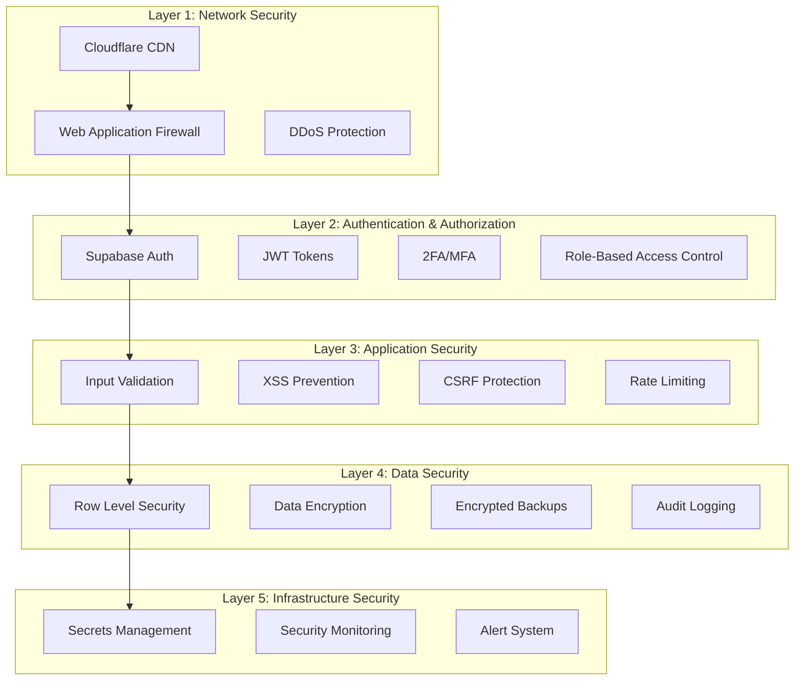
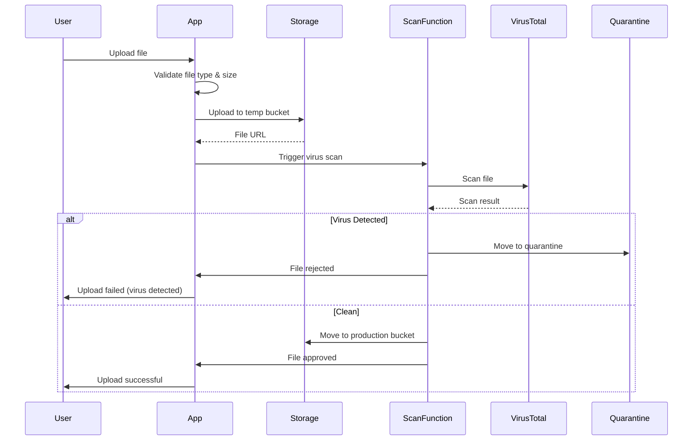

# Security Architecture

**Document:** 07 - Security Architecture  
**Laatst Bijgewerkt:** 2025-01-25  
**Status:** ✅ Volledig

## Overzicht

Dit document beschrijft de security architectuur, threat model, en beveiligingsmaatregelen van het Arabic Learning Platform.

## Security Layers



---

## Authentication & Authorization

### 1. Supabase Auth Integration

**Supported Methods:**
- Email/Password (with email verification)
- Magic Link (passwordless)
- OAuth Providers (Google, GitHub - planned)
- Phone/SMS (planned)

**Implementation:**
```typescript
// Login with email/password
const { data, error } = await supabase.auth.signInWithPassword({
  email: 'user@example.com',
  password: 'secure_password'
})

// Session management
const { data: { session } } = await supabase.auth.getSession()

// Logout
await supabase.auth.signOut()
```

### 2. JWT Token Management

**Token Structure:**
```json
{
  "sub": "user-uuid",
  "email": "user@example.com",
  "role": "student",
  "iat": 1674123456,
  "exp": 1674209856,
  "app_metadata": {
    "provider": "email",
    "roles": ["student"]
  },
  "user_metadata": {
    "full_name": "Ahmed Ali",
    "avatar_url": "https://..."
  }
}
```

**Token Lifecycle:**
- **Access Token**: 1 hour expiry
- **Refresh Token**: 30 days expiry (stored in httpOnly cookie)
- **Auto-refresh**: Handled by Supabase client

### 3. Role-Based Access Control (RBAC)

**Roles:**
- `student`: Read own data, submit answers, participate in forums
- `teacher`: Read class data, grade submissions, moderate forums
- `admin`: Full access to all data and settings

**Permission Matrix:**

| Resource | Student | Teacher | Admin |
|----------|---------|---------|-------|
| View own profile | ✅ | ✅ | ✅ |
| View other profiles | ❌ | Class only | ✅ |
| Submit answers | ✅ | ❌ | ✅ |
| Grade submissions | ❌ | Class only | ✅ |
| Create content | ❌ | ✅ | ✅ |
| Moderate forum | ❌ | Class only | ✅ |
| Access analytics | ❌ | Class only | ✅ |
| Manage users | ❌ | ❌ | ✅ |

**Role Check Implementation:**
```typescript
// Service-level check
export async function isTeacherOf(teacherId: string, classId: string): Promise<boolean> {
  const { data } = await supabase
    .from('klassen')
    .select('id')
    .eq('id', classId)
    .eq('teacher_id', teacherId)
    .single()
  
  return !!data
}

// Component-level check
const { hasRole } = useAuth()
if (!hasRole('admin')) {
  return <ForbiddenPage />
}
```

---

## Row Level Security (RLS)

### Policy Structure

**Pattern 1: Own Records Only**
```sql
-- Students can only view their own progress
CREATE POLICY "students_view_own_progress"
ON student_progress FOR SELECT
USING (auth.uid() = student_id);
```

**Pattern 2: Class-Based Access**
```sql
-- Teachers can view progress of their class students
CREATE POLICY "teachers_view_class_progress"
ON student_progress FOR SELECT
USING (
  EXISTS (
    SELECT 1 FROM klassen k
    JOIN inschrijvingen i ON k.id = i.class_id
    WHERE k.teacher_id = auth.uid()
      AND i.student_id = student_progress.student_id
  )
);
```

**Pattern 3: Role-Based Access**
```sql
-- Admins can view all data
CREATE POLICY "admins_view_all"
ON student_progress FOR SELECT
USING (
  EXISTS (
    SELECT 1 FROM profiles
    WHERE id = auth.uid() AND role = 'admin'
  )
);
```

### Critical RLS Policies

#### `antwoorden` (Student Submissions)
```sql
-- Students submit their own answers
CREATE POLICY "students_submit_answers"
ON antwoorden FOR INSERT
WITH CHECK (auth.uid() = student_id);

-- Students view their own answers
CREATE POLICY "students_view_own_answers"
ON antwoorden FOR SELECT
USING (auth.uid() = student_id);

-- Teachers grade answers of their students
CREATE POLICY "teachers_grade_answers"
ON antwoorden FOR UPDATE
USING (
  EXISTS (
    SELECT 1 FROM profiles p
    JOIN klassen k ON p.id = k.teacher_id
    JOIN inschrijvingen i ON k.id = i.class_id
    WHERE p.id = auth.uid() AND i.student_id = antwoorden.student_id
  )
);
```

#### `direct_messages`
```sql
-- Users can only view messages they sent or received
CREATE POLICY "view_own_messages"
ON direct_messages FOR SELECT
USING (auth.uid() IN (sender_id, receiver_id));

-- Users can only send messages as themselves
CREATE POLICY "send_messages"
ON direct_messages FOR INSERT
WITH CHECK (auth.uid() = sender_id);

-- Users can mark their received messages as read
CREATE POLICY "mark_messages_read"
ON direct_messages FOR UPDATE
USING (auth.uid() = receiver_id)
WITH CHECK (auth.uid() = receiver_id);
```

#### `payments`
```sql
-- Students can only view their own payments
CREATE POLICY "students_view_own_payments"
ON payments FOR SELECT
USING (auth.uid() = student_id);

-- Only system/edge functions can insert payments
CREATE POLICY "system_insert_payments"
ON payments FOR INSERT
WITH CHECK (auth.uid() IS NULL); -- Service role only
```

---

## Input Validation & Sanitization

### 1. Zod Schema Validation

**Example: Forum Post Validation**
```typescript
import { z } from 'zod'

export const forumPostSchema = z.object({
  titel: z.string()
    .min(5, 'Title must be at least 5 characters')
    .max(200, 'Title must be less than 200 characters')
    .trim(),
  inhoud: z.string()
    .min(10, 'Content must be at least 10 characters')
    .max(10000, 'Content must be less than 10000 characters'),
  class_id: z.string().uuid('Invalid class ID'),
  niveau_id: z.string().uuid().optional(),
})

// Usage
const validatedData = forumPostSchema.parse(userInput)
```

### 2. XSS Prevention

**DOMPurify Integration:**
```typescript
import DOMPurify from 'dompurify'

// Sanitize user-generated HTML
const sanitized = DOMPurify.sanitize(userInput, {
  ALLOWED_TAGS: ['p', 'br', 'strong', 'em', 'u', 'a'],
  ALLOWED_ATTR: ['href', 'target'],
  ALLOW_DATA_ATTR: false
})

// Display sanitized content
<div dangerouslySetInnerHTML={{ __html: sanitized }} />
```

### 3. SQL Injection Prevention

- ✅ Use Supabase client (parameterized queries)
- ❌ Never concatenate user input into SQL strings
- ✅ Validate all UUIDs before queries

```typescript
// ✅ Safe
const { data } = await supabase
  .from('profiles')
  .select('*')
  .eq('id', userId) // Parameterized

// ❌ Unsafe (never do this)
const query = `SELECT * FROM profiles WHERE id = '${userId}'`
```

---

## Rate Limiting & DDoS Protection

### 1. Auth Rate Limiting

```sql
CREATE TABLE auth_rate_limits (
  id UUID PRIMARY KEY DEFAULT gen_random_uuid(),
  identifier TEXT NOT NULL, -- IP or user ID
  action_type TEXT NOT NULL, -- 'login', 'signup', 'password_reset'
  attempt_count INT DEFAULT 0,
  first_attempt TIMESTAMPTZ DEFAULT NOW(),
  last_attempt TIMESTAMPTZ DEFAULT NOW(),
  blocked_until TIMESTAMPTZ,
  created_at TIMESTAMPTZ DEFAULT NOW()
);

-- Rate limit: 5 login attempts per 15 minutes
CREATE INDEX idx_auth_rate_limits_identifier ON auth_rate_limits(identifier, action_type);
```

**Implementation:**
```typescript
async function checkRateLimit(identifier: string, action: string): Promise<boolean> {
  const { data } = await supabase
    .from('auth_rate_limits')
    .select('*')
    .eq('identifier', identifier)
    .eq('action_type', action)
    .gte('first_attempt', new Date(Date.now() - 15 * 60 * 1000))
    .single()

  if (data && data.attempt_count >= 5) {
    return false // Rate limit exceeded
  }

  // Increment attempt count
  await supabase
    .from('auth_rate_limits')
    .upsert({
      identifier,
      action_type: action,
      attempt_count: (data?.attempt_count || 0) + 1,
      last_attempt: new Date()
    })

  return true
}
```

### 2. API Rate Limiting

- **Edge Functions**: 100 requests/minute per IP
- **Database Queries**: 1000 requests/hour per user
- **File Uploads**: 10 uploads/minute per user

---

## Data Encryption

### 1. Encryption at Rest

- **Database**: PostgreSQL transparent data encryption (TDE)
- **Storage Buckets**: AES-256 encryption
- **Backups**: Encrypted with GPG before upload

### 2. Encryption in Transit

- **TLS 1.3**: All connections use TLS 1.3
- **HTTPS Only**: Strict HTTPS enforcement
- **HSTS Header**: `Strict-Transport-Security: max-age=31536000; includeSubDomains`

### 3. Secrets Management

```typescript
// ✅ Use environment variables
const STRIPE_SECRET_KEY = import.meta.env.VITE_STRIPE_SECRET_KEY

// ❌ Never hardcode secrets
const STRIPE_SECRET_KEY = 'sk_live_abc123...' // BAD!
```

**Secrets Storage:**
- Development: `.env.local` (gitignored)
- Production: Supabase Edge Function secrets
- CI/CD: GitHub Secrets

---

## Content Security Policy (CSP)

```html
<meta http-equiv="Content-Security-Policy" content="
  default-src 'self';
  script-src 'self' 'unsafe-inline' https://cdn.jsdelivr.net;
  style-src 'self' 'unsafe-inline';
  img-src 'self' data: https:;
  font-src 'self' data:;
  connect-src 'self' https://*.supabase.co https://api.stripe.com;
  frame-src https://js.stripe.com;
  object-src 'none';
  base-uri 'self';
  form-action 'self';
  upgrade-insecure-requests;
">
```

---

## Audit Logging

### 1. Audit Log Table

```sql
CREATE TABLE audit_log (
  id UUID PRIMARY KEY DEFAULT gen_random_uuid(),
  user_id UUID REFERENCES profiles(id),
  actie TEXT NOT NULL,
  resource_type TEXT,
  resource_id UUID,
  old_values JSONB,
  new_values JSONB,
  ip_address INET,
  user_agent TEXT,
  session_id TEXT,
  severity TEXT DEFAULT 'info',
  details JSONB,
  created_at TIMESTAMPTZ DEFAULT NOW()
);

CREATE INDEX idx_audit_user ON audit_log(user_id, created_at);
CREATE INDEX idx_audit_resource ON audit_log(resource_type, resource_id);
CREATE INDEX idx_audit_severity ON audit_log(severity) WHERE severity IN ('warn', 'error');
```

### 2. Logged Events

**High-Severity Events:**
- Failed login attempts
- Password changes
- Role changes
- Data exports
- RLS policy violations
- Suspicious activity patterns

**Standard Events:**
- User login/logout
- Resource creation/update/deletion
- Payment transactions
- File uploads

**Implementation:**
```typescript
async function logAuditEvent(event: AuditEvent) {
  await supabase
    .from('audit_log')
    .insert({
      user_id: event.userId,
      actie: event.action,
      resource_type: event.resourceType,
      resource_id: event.resourceId,
      old_values: event.oldValues,
      new_values: event.newValues,
      ip_address: event.ipAddress,
      user_agent: event.userAgent,
      severity: event.severity || 'info',
      details: event.details
    })
}
```

---

## File Upload Security

### 1. Virus Scanning



### 2. File Upload Policies

```typescript
const ALLOWED_FILE_TYPES = {
  documents: ['application/pdf', 'application/msword'],
  images: ['image/jpeg', 'image/png', 'image/webp'],
  audio: ['audio/mpeg', 'audio/wav'],
  video: ['video/mp4', 'video/webm']
}

const MAX_FILE_SIZE = 50 * 1024 * 1024 // 50MB

async function validateUpload(file: File): Promise<boolean> {
  // Check file type
  if (!Object.values(ALLOWED_FILE_TYPES).flat().includes(file.type)) {
    throw new Error('File type not allowed')
  }

  // Check file size
  if (file.size > MAX_FILE_SIZE) {
    throw new Error('File too large')
  }

  // Check file extension matches MIME type
  const extension = file.name.split('.').pop()?.toLowerCase()
  if (!isValidExtension(extension, file.type)) {
    throw new Error('File extension mismatch')
  }

  return true
}
```

---

## Security Monitoring & Alerts

### 1. Real-time Alerts

**Alert Triggers:**
- 5+ failed login attempts from same IP
- Unusual data export volume
- RLS policy bypass attempts
- Suspicious SQL injection patterns
- Elevated privilege escalation attempts

**Alert Channels:**
- Email (admin@platform.com)
- Slack webhook
- SMS (for critical alerts)

### 2. Security Metrics

**Tracked Metrics:**
- Failed authentication rate
- Average session duration
- Anomalous access patterns
- API error rates
- Database query performance

---

## Incident Response Plan

### 1. Security Incident Levels

| Level | Description | Response Time | Actions |
|-------|-------------|---------------|---------|
| P1 - Critical | Data breach, system compromise | Immediate | Block access, notify users, forensics |
| P2 - High | Attempted breach, DDoS | < 1 hour | Investigate, block IPs, patch |
| P3 - Medium | Suspicious activity | < 4 hours | Monitor, log, review patterns |
| P4 - Low | Policy violations | < 24 hours | Log, user warning |

### 2. Breach Response Checklist

1. **Contain**: Isolate affected systems
2. **Investigate**: Identify attack vector and scope
3. **Eradicate**: Remove malicious code/access
4. **Recover**: Restore from clean backups
5. **Notify**: Inform affected users (GDPR compliance)
6. **Review**: Post-mortem and lessons learned

---

## Compliance & Standards

### GDPR Compliance

- ✅ Right to access (data export)
- ✅ Right to erasure (account deletion)
- ✅ Right to rectification (profile updates)
- ✅ Data portability (JSON export)
- ✅ Consent management
- ✅ Privacy policy
- ✅ Cookie policy

### Security Standards

- **OWASP Top 10**: Mitigation strategies implemented
- **CWE/SANS Top 25**: Regular vulnerability scans
- **ISO 27001**: Information security management practices

---

## Security Checklist

- [x] Supabase Auth with email verification
- [x] Row Level Security (RLS) on all tables
- [x] Input validation with Zod schemas
- [x] XSS prevention with DOMPurify
- [x] CSRF protection (SameSite cookies)
- [x] Rate limiting on auth endpoints
- [x] Encrypted backups
- [x] Audit logging
- [x] File upload validation & virus scanning
- [x] Content Security Policy (CSP)
- [x] HTTPS/TLS 1.3 enforcement
- [x] Secrets management
- [ ] 2FA/MFA (planned)
- [ ] Penetration testing (planned)
- [ ] SOC 2 compliance (planned)

---

## References

- [Database Schema](./06-database-schema.md)
- [Edge Functions](./05-edge-functions.md)
- [OWASP Top 10](https://owasp.org/www-project-top-ten/)
- [Supabase Security Best Practices](https://supabase.com/docs/guides/auth/row-level-security)
