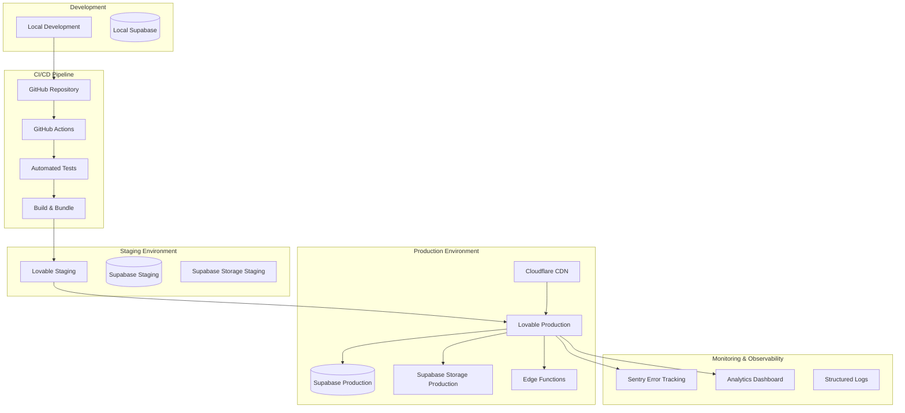

# Deployment Architecture

**Document:** 08 - Deployment Architecture  
**Laatst Bijgewerkt:** 2025-01-25  
**Status:** ✅ Volledig

## Overzicht

Dit document beschrijft de deployment architectuur, CI/CD pipelines, en infrastructure-as-code strategie voor het Arabic Learning Platform.

## Infrastructure Overview



---

## Environment Strategy

### 1. Local Development

**Setup:**
```bash
# Clone repository
git clone https://github.com/user/arabisch-online-leren.git
cd arabisch-online-leren

# Install dependencies
npm install

# Start Supabase local
npx supabase start

# Start dev server
npm run dev
```

**Environment Variables (`.env.local`):**
```bash
VITE_SUPABASE_URL=http://localhost:54321
VITE_SUPABASE_ANON_KEY=eyJhbGciOiJI...
VITE_STRIPE_PUBLISHABLE_KEY=pk_test_...
VITE_APP_ENV=development
```

**Features:**
- Hot module replacement (HMR)
- Local Supabase instance
- Mock payment service (Stripe test mode)
- Instant feedback loop

---

### 2. Staging Environment

**Purpose:**
- Integration testing
- User acceptance testing (UAT)
- Performance testing
- Security testing

**Deployment:**
- **Automatic**: On push to `develop` branch
- **Manual**: Via Lovable UI or GitHub Actions
- **Rollback**: Instant via Lovable dashboard

**Configuration:**
```bash
VITE_SUPABASE_URL=https://staging.supabase.co
VITE_SUPABASE_ANON_KEY=eyJhbGciOiJI...
VITE_STRIPE_PUBLISHABLE_KEY=pk_test_...
VITE_APP_ENV=staging
VITE_ENABLE_DEBUG=true
```

**Database:**
- Separate Supabase project
- Anonymized production data (monthly refresh)
- Same schema as production

---

### 3. Production Environment

**Deployment Strategy:**
- **Blue-Green Deployment**: Zero-downtime deployments
- **Canary Releases**: 5% traffic → 50% → 100%
- **Rollback Window**: Instant rollback within 1 hour

**Configuration:**
```bash
VITE_SUPABASE_URL=https://prod.supabase.co
VITE_SUPABASE_ANON_KEY=eyJhbGciOiJI...
VITE_STRIPE_PUBLISHABLE_KEY=pk_live_...
VITE_APP_ENV=production
VITE_ENABLE_DEBUG=false
VITE_SENTRY_DSN=https://...@sentry.io/...
```

**CDN Configuration:**
- **Provider**: Cloudflare
- **Edge Locations**: Global
- **Cache TTL**: 1 hour for static assets
- **Purge Strategy**: Automatic on deployment

---

## CI/CD Pipeline

### GitHub Actions Workflow

```yaml
name: CI/CD Pipeline

on:
  push:
    branches: [main, develop]
  pull_request:
    branches: [main, develop]

jobs:
  test:
    runs-on: ubuntu-latest
    steps:
      - uses: actions/checkout@v3
      
      - name: Setup Node.js
        uses: actions/setup-node@v3
        with:
          node-version: '20'
          cache: 'npm'
      
      - name: Install dependencies
        run: npm ci
      
      - name: Run linter
        run: npm run lint
      
      - name: Run type check
        run: npm run typecheck
      
      - name: Run unit tests
        run: npm run test:unit
      
      - name: Run E2E tests
        run: npm run test:e2e
      
      - name: Upload coverage
        uses: codecov/codecov-action@v3

  build:
    needs: test
    runs-on: ubuntu-latest
    steps:
      - uses: actions/checkout@v3
      
      - name: Setup Node.js
        uses: actions/setup-node@v3
        with:
          node-version: '20'
          cache: 'npm'
      
      - name: Install dependencies
        run: npm ci
      
      - name: Build application
        run: npm run build
        env:
          VITE_SUPABASE_URL: ${{ secrets.VITE_SUPABASE_URL }}
          VITE_SUPABASE_ANON_KEY: ${{ secrets.VITE_SUPABASE_ANON_KEY }}
      
      - name: Upload build artifacts
        uses: actions/upload-artifact@v3
        with:
          name: dist
          path: dist/

  deploy-staging:
    needs: build
    if: github.ref == 'refs/heads/develop'
    runs-on: ubuntu-latest
    environment: staging
    steps:
      - name: Download build artifacts
        uses: actions/download-artifact@v3
        with:
          name: dist
      
      - name: Deploy to Lovable Staging
        run: |
          # Lovable CLI deployment (conceptual)
          npm run deploy:staging
        env:
          LOVABLE_API_KEY: ${{ secrets.LOVABLE_API_KEY }}

  deploy-production:
    needs: build
    if: github.ref == 'refs/heads/main'
    runs-on: ubuntu-latest
    environment: production
    steps:
      - name: Download build artifacts
        uses: actions/download-artifact@v3
        with:
          name: dist
      
      - name: Deploy to Lovable Production
        run: |
          npm run deploy:production
        env:
          LOVABLE_API_KEY: ${{ secrets.LOVABLE_API_KEY }}
      
      - name: Purge CDN cache
        run: |
          curl -X POST "https://api.cloudflare.com/client/v4/zones/${{ secrets.CF_ZONE_ID }}/purge_cache" \
            -H "Authorization: Bearer ${{ secrets.CF_API_TOKEN }}" \
            -H "Content-Type: application/json" \
            --data '{"purge_everything":true}'
      
      - name: Create Sentry release
        run: |
          npx @sentry/cli releases new ${{ github.sha }}
          npx @sentry/cli releases finalize ${{ github.sha }}
        env:
          SENTRY_AUTH_TOKEN: ${{ secrets.SENTRY_AUTH_TOKEN }}
```

---

## Database Migrations

### Migration Strategy

**Development:**
```bash
# Create new migration
npx supabase migration new add_user_preferences

# Edit migration file
vim supabase/migrations/20250125_add_user_preferences.sql

# Apply locally
npx supabase db reset

# Test migration
npm run test:migrations
```

**Staging:**
```bash
# Push migrations to staging
npx supabase db push --project-ref staging-project-ref

# Verify schema
npx supabase db diff
```

**Production:**
```bash
# Backup before migration
npm run backup:production

# Apply migrations
npx supabase db push --project-ref production-project-ref

# Smoke test
npm run test:smoke -- --env=production
```

### Migration Rollback

```sql
-- Each migration has a corresponding rollback
-- File: supabase/migrations/20250125_add_user_preferences_rollback.sql

ALTER TABLE profiles DROP COLUMN IF EXISTS preferences;
DROP INDEX IF EXISTS idx_profiles_preferences;
```

---

## Edge Functions Deployment

### Deployment Process

```bash
# Deploy single function
npx supabase functions deploy virus-scan

# Deploy all functions
npx supabase functions deploy

# Test function locally
npx supabase functions serve virus-scan

# Invoke function
curl -i --location --request POST \
  'https://PROJECT_REF.supabase.co/functions/v1/virus-scan' \
  --header 'Authorization: Bearer ANON_KEY' \
  --header 'Content-Type: application/json' \
  --data '{"file_path": "uploads/test.pdf"}'
```

### Function Configuration

**Environment Variables:**
```bash
# Set secrets for edge functions
npx supabase secrets set VIRUSTOTAL_API_KEY=abc123...
npx supabase secrets set STRIPE_SECRET_KEY=sk_live_...
npx supabase secrets set SENDGRID_API_KEY=SG.abc123...

# List secrets
npx supabase secrets list
```

---

## Monitoring & Observability

### 1. Error Tracking (Sentry)

```typescript
import * as Sentry from '@sentry/react'

Sentry.init({
  dsn: import.meta.env.VITE_SENTRY_DSN,
  environment: import.meta.env.VITE_APP_ENV,
  tracesSampleRate: 1.0,
  integrations: [
    new Sentry.BrowserTracing(),
    new Sentry.Replay()
  ],
  replaysSessionSampleRate: 0.1,
  replaysOnErrorSampleRate: 1.0
})

// Error boundary
<Sentry.ErrorBoundary fallback={<ErrorFallback />}>
  <App />
</Sentry.ErrorBoundary>
```

### 2. Performance Monitoring

```typescript
import { getCLS, getFID, getFCP, getLCP, getTTFB } from 'web-vitals'

function sendToAnalytics(metric: Metric) {
  // Send to analytics service
  fetch('/api/analytics', {
    method: 'POST',
    body: JSON.stringify(metric)
  })
}

getCLS(sendToAnalytics)
getFID(sendToAnalytics)
getFCP(sendToAnalytics)
getLCP(sendToAnalytics)
getTTFB(sendToAnalytics)
```

### 3. Structured Logging

```typescript
const logger = {
  info: (message: string, context?: object) => {
    console.log(JSON.stringify({
      level: 'info',
      message,
      timestamp: new Date().toISOString(),
      env: import.meta.env.VITE_APP_ENV,
      ...context
    }))
  },
  error: (message: string, error: Error, context?: object) => {
    console.error(JSON.stringify({
      level: 'error',
      message,
      error: {
        name: error.name,
        message: error.message,
        stack: error.stack
      },
      timestamp: new Date().toISOString(),
      env: import.meta.env.VITE_APP_ENV,
      ...context
    }))
  }
}

// Usage
logger.info('User logged in', { userId: 'abc123', email: 'user@example.com' })
logger.error('Payment failed', error, { orderId: 'ord_123', amount: 49.99 })
```

---

## Backup & Disaster Recovery

### Automated Backups

**Daily Backups (02:00 UTC):**
```bash
#!/bin/bash
# GitHub Actions workflow: .github/workflows/backup.yml

# Export database
npx supabase db dump --project-ref $PROJECT_REF > backup.sql

# Encrypt backup
gpg --symmetric --cipher-algo AES256 backup.sql

# Upload to GitHub Artifacts
gh release create backup-$(date +%Y%m%d) backup.sql.gpg

# Cleanup old backups (30 days retention)
find . -name "backup-*.sql.gpg" -mtime +30 -delete
```

**Backup Verification:**
```bash
# Weekly restore test to staging
npx supabase db reset --project-ref staging-project-ref
psql -h staging.supabase.co -d postgres -f backup.sql
npm run test:smoke -- --env=staging
```

### Disaster Recovery Plan

**RTO (Recovery Time Objective):** < 1 hour  
**RPO (Recovery Point Objective):** < 24 hours

**Recovery Steps:**
1. **Assess**: Identify incident scope and impact
2. **Communicate**: Notify stakeholders via status page
3. **Restore**: Deploy last known good version
4. **Verify**: Run smoke tests and health checks
5. **Monitor**: Watch metrics for anomalies
6. **Post-mortem**: Document incident and learnings

---

## Infrastructure as Code (Terraform)

### Project Structure

```
terraform/
├── main.tf              # Main configuration
├── variables.tf         # Input variables
├── outputs.tf           # Output values
├── modules/
│   ├── supabase/       # Supabase configuration
│   ├── cloudflare/     # CDN and DNS
│   └── monitoring/     # Sentry and analytics
└── environments/
    ├── staging/        # Staging environment
    └── production/     # Production environment
```

### Example: Supabase Project

```hcl
# terraform/modules/supabase/main.tf

terraform {
  required_providers {
    supabase = {
      source  = "supabase/supabase"
      version = "~> 1.0"
    }
  }
}

resource "supabase_project" "main" {
  name              = var.project_name
  organization_id   = var.organization_id
  database_password = var.database_password
  region            = var.region

  settings = {
    db_version     = "15"
    db_size        = "small"
    auth_enabled   = true
    storage_enabled = true
  }
}

resource "supabase_bucket" "avatars" {
  name       = "avatars"
  public     = true
  project_id = supabase_project.main.id

  allowed_mime_types = ["image/jpeg", "image/png", "image/webp"]
  file_size_limit    = 5242880 # 5MB
}

output "project_url" {
  value = supabase_project.main.url
}

output "anon_key" {
  value     = supabase_project.main.anon_key
  sensitive = true
}
```

---

## Performance Optimization

### 1. Build Optimization

```typescript
// vite.config.ts
export default defineConfig({
  build: {
    rollupOptions: {
      output: {
        manualChunks: {
          vendor: ['react', 'react-dom', 'react-router-dom'],
          supabase: ['@supabase/supabase-js'],
          ui: ['@radix-ui/react-dialog', '@radix-ui/react-dropdown-menu'],
          charts: ['recharts']
        }
      }
    },
    minify: 'terser',
    terserOptions: {
      compress: {
        drop_console: true,
        drop_debugger: true
      }
    }
  }
})
```

### 2. Image Optimization

```typescript
// Automatic WebP conversion

```

### 3. Code Splitting

```typescript
// Lazy load routes
const Dashboard = lazy(() => import('./pages/Dashboard'))
const Forum = lazy(() => import('./pages/Forum'))
const Analytics = lazy(() => import('./pages/Analytics'))

<Suspense fallback={<LoadingSkeleton />}>
  <Routes>
    <Route path="/dashboard" element={<Dashboard />} />
    <Route path="/forum" element={<Forum />} />
    <Route path="/analytics" element={<Analytics />} />
  </Routes>
</Suspense>
```

---

## Security in Deployment

### 1. Secrets Management

```bash
# GitHub Secrets
VITE_SUPABASE_URL
VITE_SUPABASE_ANON_KEY
VITE_STRIPE_PUBLISHABLE_KEY
LOVABLE_API_KEY
SENTRY_AUTH_TOKEN
CF_API_TOKEN
```

### 2. Environment Variable Validation

```typescript
import { z } from 'zod'

const envSchema = z.object({
  VITE_SUPABASE_URL: z.string().url(),
  VITE_SUPABASE_ANON_KEY: z.string().min(1),
  VITE_STRIPE_PUBLISHABLE_KEY: z.string().startsWith('pk_'),
  VITE_APP_ENV: z.enum(['development', 'staging', 'production'])
})

// Validate on app startup
const env = envSchema.parse(import.meta.env)
```

---

## Deployment Checklist

**Pre-Deployment:**
- [ ] All tests passing (unit + integration + E2E)
- [ ] Code review approved
- [ ] Database migrations tested
- [ ] Environment variables configured
- [ ] Secrets rotated (if needed)
- [ ] Backup created
- [ ] Staging deployment successful

**Deployment:**
- [ ] Deploy to production
- [ ] Run smoke tests
- [ ] Verify database migrations
- [ ] Check error rates in Sentry
- [ ] Monitor performance metrics
- [ ] Purge CDN cache

**Post-Deployment:**
- [ ] User acceptance testing
- [ ] Monitor for 1 hour
- [ ] Check support tickets
- [ ] Update changelog
- [ ] Tag release in Git

---

## References

- [High-Level Architecture](./01-high-level-architecture.md)
- [Security Architecture](./07-security-architecture.md)
- [Edge Functions](./05-edge-functions.md)
- [Supabase CLI Documentation](https://supabase.com/docs/guides/cli)
- [Terraform Supabase Provider](https://registry.terraform.io/providers/supabase/supabase/latest/docs)
