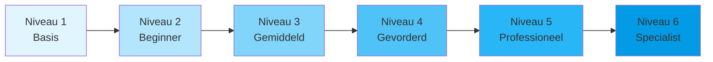
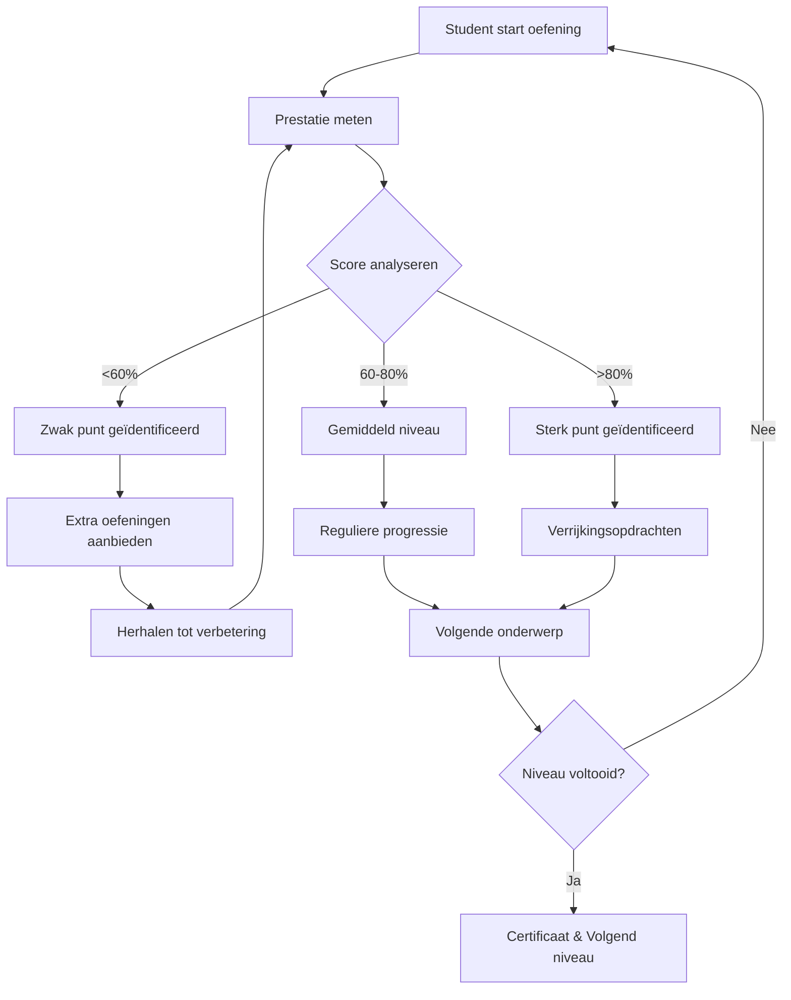

# 📚 Curriculum Documentatie

Welkom bij de curriculum documentatie voor het Arabisch Leerplatform.

## 🎯 Overzicht

Ons curriculum is gestructureerd in **6 niveaus**, van basis tot specialist, ontworpen om studenten systematisch te begeleiden in hun Arabische taalvaardigheid.

## 📖 Inhoud

1. [Niveau Overzicht](./niveaus-overzicht.md)
2. [Taxonomie & Mapping](./taxonomie-mapping.md)
3. [Leer Doelen per Niveau](./leerdoelen.md)
4. [Adaptief Leren Algoritme](./adaptief-algoritme.md)
5. [Content Mapping Structuur](./content-mapping.md)

## 🎓 De 6 Niveaus

| Niveau | Nederlands | English | العربية | Doelgroep |
|--------|-----------|---------|---------|-----------|
| 1 | Basis | Beginner | المبتدئ | Absolute beginners, geen voorkennis |
| 2 | Beginner | Elementary | الأساسي | Basis gelegd, dagelijkse communicatie |
| 3 | Gemiddeld | Intermediate | المتوسط | Comfort in vertrouwde situaties |
| 4 | Gevorderd | Advanced | المتقدم | Vloeiend in complexe onderwerpen |
| 5 | Professioneel | Professional | الاحترافي | Literatuur en historische teksten |
| 6 | Specialist | Specialist | المتخصص | Academisch niveau, kritische analyse |

## 🧠 Leer Filosofie

### 1. **Scaffolding Approach**
Elk niveau bouwt voort op het vorige met:
- Incrementele complexiteit
- Herhaling voor consolidatie
- Praktische toepassingen
- Culturele contextualisering

### 2. **Vier Pijlers van Taalleren**
1. **Lezen (قراءة)**: Begrijpend lezen van teksten
2. **Schrijven (كتابة)**: Correcte spelling en compositie
3. **Vormleer (الصرف)**: Grammaticale structuren en patronen
4. **Grammatica (النحو)**: Zinsbouw en taalregels

### 3. **Adaptief Leren**
Het platform past zich aan aan de student:
- **Analytics-driven**: Prestaties worden geanalyseerd
- **Persoonlijke paden**: Aanbevelingen op maat
- **Zwakke punten**: Gerichte oefeningen
- **Sterke punten**: Verrijking en uitdaging

### 4. **Culturele Integratie**
Arabisch leren betekent ook cultuur leren:
- Authentieke teksten (gedichten, verhalen)
- Culturele contexten (tradities, geschiedenis)
- Moderne toepassingen (media, zakelijk)
- Religieuze teksten (optioneel, met respect)

## 📊 Progressie Model

### Voltooiingscriteria per Niveau
- **Theoretische kennis**: ≥80% score op toetsen
- **Praktische vaardigheid**: ≥75% correct in oefeningen
- **Consistentie**: 3 opeenvolgende weken op niveau
- **Docent beoordeling**: Optioneel, voor certificatie

## 🎯 Leerdoelen Tabel

| Niveau | Alfabet | Zinnen | Teksten | Spelling | Grammatica | Tijd (uur) |
|--------|---------|--------|---------|----------|------------|------------|
| 1 | ✅ Volledig | Eenvoudig | Woorden | Basis | Naamzin | ~50 |
| 2 | ✅ Vloeiend | Dagelijks | Korte teksten | Interpunctie | Voornaamwoorden | ~100 |
| 3 | ✅ Beheersing | Complex | Verhalen | Hamza's | Voorwaardelijk | ~150 |
| 4 | ✅ Perfect | Discussie | Artikelen | Precies | Uitzonderingen | ~200 |
| 5 | ✅ Meesterschap | Academisch | Literatuur | Foutloos | Diepte-analyse | ~300 |
| 6 | ✅ Expertise | Kritisch | Historisch | Perfectie | Alles | ~400+ |

## 🔄 Adaptieve Leer Cyclus

## 🏆 Certificering

### Niveau Certificaten
Na voltooiing van elk niveau ontvangen studenten:
- **Digitaal certificaat**: PDF met QR-code verificatie
- **Badge**: Voor online portfolio
- **Transcript**: Gedetailleerde score breakdown

### Vereisten voor Certificaat
1. ✅ Alle oefeningen voltooid (≥75%)
2. ✅ Eindtoets geslaagd (≥80%)
3. ✅ Actieve participatie (forum, taken)
4. ✅ Docent goedkeuring (indien van toepassing)

## 📈 Analytics & Tracking

Het platform houdt bij:
- **Tijd per oefening**: Identificeer moeilijke concepten
- **Foutpatronen**: Automatische analyse van veelgemaakte fouten
- **Vooruitgang over tijd**: Visualisatie van groei
- **Vergelijking met peers**: Motiverend (optioneel, privacy-bewust)

## 🌍 Internationalisatie

Alle curriculum content is beschikbaar in:
- **Nederlands**: Voor Nederlandstalige studenten
- **Engels**: Voor internationale studenten
- **Arabisch**: Voor native speakers (als referentie)

---

## 📚 Volgende Stappen

- [Niveau Overzicht](./niveaus-overzicht.md): Gedetailleerde beschrijving per niveau
- [Taxonomie & Mapping](./taxonomie-mapping.md): Technische implementatie
- [Adaptief Algoritme](./adaptief-algoritme.md): Hoe het systeem leert

---

**Laatst bijgewerkt:** 24 november 2025
