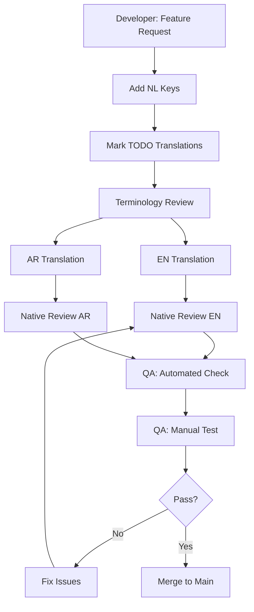

# 🔄 Vertaalworkflow

Complete proces voor het toevoegen en beheren van vertalingen.

## 📋 Workflow Overzicht



## 1️⃣ Developer: Nieuwe Keys Toevoegen

### Stap 1: Feature Development
Tijdens feature development, gebruik i18n voor alle UI tekst:

```tsx
// ❌ WRONG: Hardcoded text
<Button>Start Lesson</Button>

// ✅ CORRECT: i18n key
<Button>{t('lessons.start')}</Button>
```

### Stap 2: Add to nl.json
Voeg Nederlandse vertaling toe:

```json
{
  "lessons": {
    "start": "Les Starten",
    "complete": "Voltooien",
    "skip": "Overslaan"
  }
}
```

### Stap 3: Mark Missing Translations
Voeg placeholders toe voor EN/AR:

**en.json:**
```json
{
  "lessons": {
    "start": "[TODO:EN] Les Starten",
    "complete": "[TODO:EN] Voltooien",
    "skip": "[TODO:EN] Overslaan"
  }
}
```

**ar.json:**
```json
{
  "lessons": {
    "start": "[TODO:AR] Les Starten",
    "complete": "[TODO:AR] Voltooien",
    "skip": "[TODO:AR] Overslaan"
  }
}
```

### Stap 4: Create PR
```bash
git checkout -b feature/lesson-navigation
git add src/i18n/locales/*.json
git commit -m "feat: Add lesson navigation with i18n placeholders"
git push origin feature/lesson-navigation
```

## 2️⃣ Terminology Specialist: Review

### Rol Beschrijving
**Verantwoordelijk voor:**
- Consistency van terminologie
- Toevoegen aan master terminologielijst
- Resolven van conflicten tussen vertalers

### Workflow

#### Stap 1: Review PR
Check nieuwe keys in PR:
```bash
git diff main...feature/lesson-navigation src/i18n/locales/nl.json
```

#### Stap 2: Identify New Terms
Maak lijst van nieuwe termen:
- "Les Starten" → Nieuw concept?
- "Voltooien" → Bestaande term?
- "Overslaan" → Consistentie met skip elders?

#### Stap 3: Add to Terminology Database
Update `docs/i18n/terminologie.md`:

```markdown
| NL | EN | AR | Context | Notes |
|----|----|----|---------|-------|
| Les Starten | Start Lesson | بدء الدرس | Button action | Prefer over "Begin" |
| Voltooien | Complete | إكمال | Status/Action | Used for finish state |
```

#### Stap 4: Approve PR for Translation
Comment op PR:
```
✅ Terminology approved
New terms added to database
Ready for EN/AR translation
```

## 3️⃣ EN Translator: English Translation

### Rol Beschrijving
**Native English speaker** met begrip van:
- Educational terminology
- UI/UX copy writing
- Cultural nuances

### Workflow

#### Stap 1: Find TODO Markers
```bash
grep -r "\[TODO:EN\]" src/i18n/locales/en.json
```

#### Stap 2: Translate with Context
Lees de Nederlandse tekst EN de context (waar wordt het gebruikt?):

```json
{
  "lessons": {
    "start": "Start Lesson",           // Action button
    "complete": "Complete",            // Short status
    "skip": "Skip"                     // Optional action
  }
}
```

**Translation Guidelines:**
- Keep button text concise (< 3 words)
- Use active voice
- Match formality level (professional but friendly)
- Consider character length (UI constraints)

#### Stap 3: Check Terminology Database
Verify against existing terms:
```markdown
"Les" → "Lesson" (not "Class" or "Course")
"Starten" → "Start" (not "Begin" unless specific context)
```

#### Stap 4: Test in UI (Optional but Recommended)
```bash
npm run dev
# Change language to EN
# Navigate to feature
# Verify text fits, makes sense
```

#### Stap 5: Commit Translation
```bash
git checkout feature/lesson-navigation
# Update en.json
git add src/i18n/locales/en.json
git commit -m "i18n: Add EN translations for lesson navigation"
git push
```

## 4️⃣ AR Translator: Arabic Translation

### Rol Beschrijving
**Native Arabic speaker** met:
- Modern Standard Arabic (MSA) expertise
- Understanding of educational terms
- RTL UI experience

### Workflow

#### Stap 1: Find TODO Markers
```bash
grep -r "\[TODO:AR\]" src/i18n/locales/ar.json
```

#### Stap 2: Translate with RTL Considerations

```json
{
  "lessons": {
    "start": "بدء الدرس",          // Right-to-left flow
    "complete": "إكمال",           // Short, clear
    "skip": "تخطي"                 // Common term
  }
}
```

**Translation Guidelines:**
- Use Modern Standard Arabic (MSA) not dialectال
- Avoid literal translations (translate meaning, not words)
- Consider text expansion (Arabic can be 20-30% longer)
- Use established educational terminology
- Maintain formality level (more formal than NL/EN)

#### Stap 3: RTL Layout Considerations
Note if translation impacts layout:
```json
{
  "lessons": {
    "start": "بدء الدرس",
    "_rtl_note": "Button may need wider width due to Arabic text length"
  }
}
```

#### Stap 4: Verify Cultural Appropriateness
Check:
- No offensive terms
- Culturally appropriate examples
- Respectful tone (especially for teacher-student context)

#### Stap 5: Commit Translation
```bash
git checkout feature/lesson-navigation
# Update ar.json
git add src/i18n/locales/ar.json
git commit -m "i18n: Add AR translations for lesson navigation"
git push
```

## 5️⃣ Native Reviewers: Quality Check

### EN Reviewer
**Another native English speaker** reviews:

```markdown
Review Checklist:
- [ ] Grammar correct
- [ ] Sounds natural (not translated feel)
- [ ] Consistent with existing translations
- [ ] Appropriate formality level
- [ ] No cultural insensitivity
- [ ] Terminology matches database
```

### AR Reviewer
**Another native Arabic speaker** reviews:

```markdown
Review Checklist:
- [ ] MSA correct (no dialect mixing)
- [ ] Grammar and diacritics correct
- [ ] Sounds natural in Arabic
- [ ] Culturally appropriate
- [ ] Consistent with educational terminology
- [ ] RTL considerations noted
```

## 6️⃣ QA: Automated Check

### Automated Tests
```bash
npm run i18n:check
```

**Checks:**
1. ✅ All keys present in all locales
2. ✅ No TODO markers remaining
3. ✅ No duplicate keys
4. ✅ JSON syntax valid
5. ✅ No empty strings
6. ✅ Special characters escaped

**Example Output:**
```
✅ nl.json: 1,234 keys
✅ en.json: 1,234 keys
✅ ar.json: 1,234 keys
✅ No missing keys
✅ No TODO markers
✅ All files valid JSON
```

## 7️⃣ QA: Manual Testing

### Test Scenarios

#### Test 1: Language Switching
1. Start app in NL
2. Navigate to feature
3. Switch to EN → Verify all text changes
4. Switch to AR → Verify all text changes + RTL
5. Switch back to NL → Verify no issues

#### Test 2: RTL Layout (Arabic)
1. Set language to AR
2. Navigate through all pages
3. Check:
   - [ ] Text aligns right
   - [ ] Icons mirror correctly
   - [ ] Navigation flows right-to-left
   - [ ] Forms align properly
   - [ ] No text overflow

#### Test 3: Text Length
1. Check each language for UI overflow
2. Especially important for:
   - Buttons (limited space)
   - Tooltips (should wrap)
   - Table headers (should truncate gracefully)
   - Mobile views (smaller screens)

#### Test 4: Pluralization
```json
{
  "lessons": {
    "count": "{{count}} les",
    "count_plural": "{{count}} lessen"
  }
}
```

Test with:
- 0 lessons
- 1 lesson
- 2+ lessons

#### Test 5: Interpolation
```json
{
  "welcome": "Welkom, {{name}}!"
}
```

Test with:
- Short name
- Long name
- Special characters in name

## 8️⃣ Merge Process

### Final Checklist
```markdown
Pre-Merge Checklist:
- [ ] All TODO markers removed
- [ ] Automated tests pass
- [ ] Manual testing complete
- [ ] EN review approved
- [ ] AR review approved
- [ ] Terminology database updated
- [ ] No merge conflicts
- [ ] CI/CD passes
```

### Merge Command
```bash
# Squash commits for clean history
git checkout main
git merge --squash feature/lesson-navigation
git commit -m "feat(i18n): Add lesson navigation translations (NL/EN/AR)"
git push origin main
```

## 🔄 Continuous Process

### Weekly Tasks
**Every Monday:**
1. Run i18n coverage report
2. Identify gaps
3. Assign to translators
4. Update terminology database

### Monthly Tasks
**First of Month:**
1. Review and update translation guidelines
2. Native speaker review session
3. Audit for consistency
4. Plan upcoming features needing translation

### Quarterly Tasks
**Every 3 Months:**
1. Full terminology audit
2. User feedback review (clarity of translations)
3. Performance review of translators
4. Update this workflow document

## 🛠️ Tools & Scripts

### Check Missing Translations
```bash
npm run i18n:check
```

### Generate Translation Report
```bash
npm run i18n:report > translations-report.md
```

### Find Unused Keys
```bash
npm run i18n:unused
```

### Extract Keys from Code
```bash
npm run i18n:extract
```

## 📞 Contact

**Issues met workflow?**
- Terminology Specialist: [email]
- EN Translator Lead: [email]
- AR Translator Lead: [email]
- QA Lead: [email]

---

**Laatst bijgewerkt:** 25 november 2025
